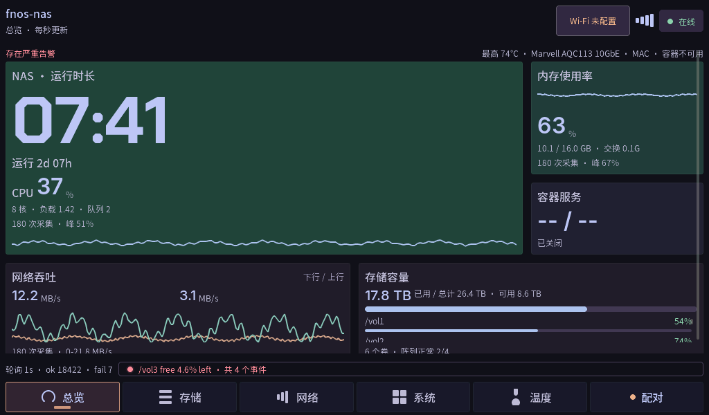
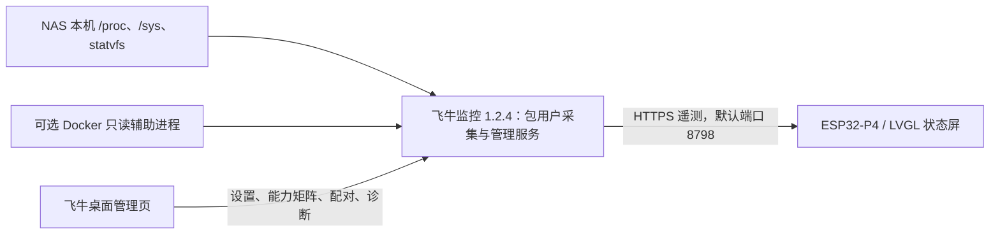

# p4-7b-fnos-monitor · 飞牛 NAS 状态屏

把 **Waveshare ESP32-P4-WIFI6-Touch-LCD-7B** 做成独立 NAS 监控屏：开发板运行 C / LVGL 9.5 原生界面，飞牛配套应用采集本机状态，两端通过 HTTPS 和设备配对连接。无需将 NAS 管理员账号或密码写入固件。

硬盘、存储卷、网口、容器和温度通道按实际数据创建卡片；名称换行、列数随可用空间调整，长清单通过滚动查看。采集失败、旧值、权限不足和未启用来源有各自的状态提示。

**当前开发源码为 `cc2da56`，包含六个数据页面，配套应用为 1.2.4。** 公开源码仍为五页基线 `ce67298`，本次只推送文档；两者差异见[最近迭代](#最近迭代与版本边界)。

| 范围 | 当前状态 |
| --- | --- |
| 当前开发源码 | 总览、存储、网络、系统、温度、独立告警六页，配对 / 配网 / 诊断覆盖层 |
| 公开固件源码 | 总览、存储、网络、系统、温度五个数据页面；配对、配网和诊断覆盖层 |
| 飞牛应用 | [1.2.4 安装包](nas/fpk/nasscreencompanion.fpk)，x86，最低 fnOS 1.2.0701，依赖 `python312` |
| 最近开发进展 | 独立告警页、监控维度摘要、页面高度预算修复、温度展开取证和格式残留审计 |
| 官方应用库 | 尚未提交；目前通过应用中心手动安装 |
| 固件分发 | 源码与配置模板；个人实机 `.bin`、NVS 和凭据不随仓库分发 |

## 界面与监控内容

默认 `device` 主题采用深紫画布、薄荷绿与桃色卡片、底部导航，提供运行时长主块、趋势图和容量比较。页面与覆盖层复用同一套 `fnos_ui.c` / `ui_kit`；主机预览编译这份真实 LVGL 源码。

| 页面 | 主要内容 |
| --- | --- |
| 总览 | NAS 运行时长、CPU、内存、网络趋势、容器摘要与存储卷比较 |
| 存储 | 容量摘要、动态卷卡片、阵列状态与同步进度、磁盘读写活动 |
| 网络 | 收发速率、双线历史、累计流量、采集状态及各网络接口清单 |
| 系统 | 系统摘要、来源状态、容器服务及硬件温度摘要 |
| 温度 | 按设备身份分组的温度卡片；手动展开多通道，不自动跳切 |
| 告警 | 严重度与事件清单；健康态展示存储、温度、容器和采集维度 |
| 配对 / 配网 / 诊断 | NAS 地址与证书确认、Wi-Fi 扫描与键盘、连接阶段和失败原因 |

点导航显示对应页面；横向拖动跟随手指，短滑回弹，纵向操作交给清单滚动。夜间背光与温度、容量参考阈值可配置。颜色参考值不能替代各硬件厂商的健康阈值。

以下为公开源码的匿名原生预览，**不是物理屏幕照片，也不包含个人 NAS 清单**：



[存储](docs/evidence/published-1.2.4/02-live-p1.png) · [网络](docs/evidence/published-1.2.4/02-live-p2.png) · [系统](docs/evidence/published-1.2.4/02-live-p3.png) · [温度](docs/evidence/published-1.2.4/02-live-p4.png) · [配对](docs/evidence/published-1.2.4/07-pair-code.png)

## 两端如何连接



管理页通过飞牛应用网关打开；遥测端口供屏幕取数据，两者分别工作。采集使用 Linux 本机来源，当前实现没有调用飞牛私有遥测 API。具体可读能力取决于本机驱动、挂载、权限及启用选项，以管理页「能力矩阵」为准。

| 数据 | 主要来源 |
| --- | --- |
| CPU、负载、内存 | `/proc/stat`、`/proc/loadavg`、`/proc/meminfo` |
| 网络接口与速率 | `/proc/net/dev`、默认路由；各接口按自己的计数器计算 |
| 存储卷、阵列、磁盘 IO | `/proc/mounts` + `statvfs`、`/proc/mdstat`、`/proc/diskstats` |
| 温度 | `/sys/class/hwmon/*/temp*_input`；只有实际可读通道才有测量值 |
| 容器服务 | 显式启用后，由受限辅助进程查询固定 Docker GET |

磁盘 IO 清单可能包含 md / dm 等逻辑设备；网络清单可能包含虚拟接口，不能将条目数视为物理硬盘或网口数量。没有 hwmon 来源的 SATA 温度、SMART 健康与所有厂商专用传感器不在兼容承诺内。

## 快速开始

### 1. 安装飞牛配套应用

1. 在 fnOS 应用中心安装依赖 `python312`。
2. 下载仓库内 [nasscreencompanion.fpk](nas/fpk/nasscreencompanion.fpk)，在「应用中心 → 手动安装」上传。
3. 保持默认 HTTPS、配对令牌和遥测端口 `8798`；按需启用容器采集。
4. 从飞牛桌面打开「飞牛监控」，检查「能力矩阵」及「诊断」。

管理服务以普通包用户运行；独立 root 辅助进程仅提供固定的容器状态读取。应用无需 SSH 部署，也不会接管旧 `fnos-agent` 的 systemd 服务。安装、升级、证书与权限排障见 [飞牛应用说明](nas/fpk/README.md)。

当前包 SHA-256：

```text
cc10d47fa9cad827ad867c243ce0f697aaaf87f847ad0b3e761ac5114eccd7b2
```

### 2. 构建并烧录开发板

| 项目 | 已验证配置 |
| --- | --- |
| 开发板 | Waveshare ESP32-P4-WIFI6-Touch-LCD-7B |
| 显示 / 触摸 | 7 英寸，1024×600 MIPI-DSI，EK79007 / GT911 |
| Wi-Fi | 板载 ESP32-C6，通过 ESP-Hosted SDIO |
| 工具链 / 目标 | ESP-IDF 5.5.3 / `esp32p4` |
| 硅片配置 | 默认 P4 rev3.x；pre-v3 与 rev3.x 固件不能互刷 |

先按自己的 ESP-IDF 安装方式激活环境，使 `IDF_PATH` 和所需 Python、RISC-V 工具链可用。例如使用 ESP-IDF 的 `export.sh`，或 EIM 提供的 activation script。

```bash
git clone https://github.com/ashllll/p4-7b-fnos-monitor.git
cd p4-7b-fnos-monitor
cp components/fnos_monitor/fnos_config.example.h components/fnos_monitor/fnos_config.h
./idf.sh build
```

模板可以直接构建；真实 Wi-Fi、NAS 地址及令牌可留在被忽略的 `fnos_config.h`，也可在屏幕上配置。`idf.sh` 支持 `FNOS_IDF_ENV=/path/to/activation.sh ./idf.sh build`，并自动设置 IDF major.minor 版本变量。模板的 `FNOS_PORT=8799` 是旧采集器回退值；使用飞牛应用时，在屏幕配对表单填写应用实际端口（默认 `8798`），保存后的运行时端点覆盖模板值。

识别自己的开发板串口，替换下面的示例路径。CH343 经 USB Hub 时，已验证的 230400 波特率可作为起点：

```bash
export FNOS_SERIAL_PORT='/dev/cu.YOUR_BOARD_PORT'
./idf.sh -p "$FNOS_SERIAL_PORT" -b 230400 flash
./idf.sh -p "$FNOS_SERIAL_PORT" monitor
```

依赖版本记录在 [dependencies.lock](dependencies.lock)。`sdkconfig.defaults` 是初始默认值；修改后已有 `sdkconfig` 不会自动覆盖，请先备份本地设置，再重新生成。本板的显示缓冲、LVGL 内存与任务栈使用 PSRAM，TLS 缓冲也配置为外部内存；移植时要保留相关配置。

### 3. 连 Wi-Fi 并配对

1. 在开发板 Wi-Fi 面板扫描并连接自己的无线网络；凭据保存到 NVS。
2. 在 NAS 管理页「设备配对」生成六位配对码。
3. 在开发板配对面板填写 NAS 地址、遥测端口及配对码。
4. 将开发板计算的证书 SHA-256 指纹与 NAS 管理页显示的指纹逐段比对，一致后确认配对。
5. 配对完成后查看总览的数据新鲜度，并检查需要的来源状态。

开发板保存地址、令牌和固定证书；NAS 只保存配对令牌的哈希。换证书需要重新确认信任；撤销设备后，该设备的后续遥测请求被拒绝。首次明文引导仅提供公开证书，不代替人工指纹确认。

## 硬件自适应与资源边界

1.2.4 采集器默认完整传送卷、阵列、磁盘、温度、容器及非 loopback 网络接口清单，名称、路径和通道身份不按固定长度截断。各接口独立测速，处理热插拔和计数器复位。若调用者显式配置数量策略，响应仍包含总数与遗漏统计。

固件的接收缓冲、动态快照和界面卡片按实际数据分配。清单增长、减少、空清单、多通道与长名称走同一布局逻辑，默认不轮播页面或温度分组。不同分辨率已通过主机矩阵验证；该开发板的物理面板仍是 1024×600。

| 配置 | 默认 | 含义 |
| --- | ---: | --- |
| `CONFIG_FNOS_STATUS_MAX_BYTES` | 262144 B | 遥测整帧字节预算 |
| `CONFIG_FNOS_SNAPSHOT_MAX_BYTES` | 1048576 B | 单份硬件清单与字符串存储预算 |
| `CONFIG_FNOS_UI_LIST_MIN_WIDTH` | 260 px | 首选清单宽度，实际列数由可用空间和文本推导 |
| `CONFIG_FNOS_UI_REDUCED_MOTION` | 关闭 | 开启后保留跟手，松手直接落定 |
| `CONFIG_FNOS_PALETTE` | `device` | 也可选 `graphite`、`abyss`、`phosphor` |

预算限制字节资源，**不是固定设备数量上限**。超预算或解析失败会保留最后有效快照并报错；UI 分配失败明确提示部分设备尚未显示。旧来源、权限不足与真正零值不能混为一谈。完整实现和矩阵范围见 [硬件自适应记录](docs/ui-hardware-adaptive-audit-2026-10-08.md)。

## 开发与验证

以下命令都从仓库根目录执行；设备命令会操作指定开发板，请按当前任务选择阶段。

```bash
# 首次先构建固件，生成真实 LVGL 配置与依赖。
./idf.sh build
# 原生界面预览与布局审计；默认输出 tools/preview/out/。
bash tools/preview/run.sh
# ELF 静态栈预算；不代替运行期测量。
python3 tools/stack_check.py

# 采集、容器 IPC、权限迁移与配置保留回归。
python3 nas/fpk/collector_check.py
python3 nas/fpk/docker_check.py
python3 nas/fpk/startup_permission_check.py
python3 nas/fpk/config_persistence_check.py
python3 nas/fpk/temps_check.py
# 打包需要 fnpack；脚本清理缓存后检查包内文件。
bash nas/fpk/build.sh
# 在匿名临时布局中走安装、启动、设置、升级和卸载。
bash nas/fpk/test_lifecycle.sh
```

主机预览、硬件组合、首次配对、动效响应与分配失败命令见 [预览说明](tools/preview/README.md)。已有预览构建后，`bash tools/verify_all.sh` 汇总布局、固件构建和栈检查；`--flash --port "$FNOS_SERIAL_PORT"` 增加烧录及串口观察，`--photo` 调用本机 `capture-board`。

当前开发版页面编号为 0–5，可用 `python3 tools/page_shot.py --port "$FNOS_SERIAL_PORT" --page 4 --temp 0` 查看第一个多通道温度设备的展开态。拍屏需要 pyserial、ADB 授权的 Android 手机、前台相机及可用的 `capture-board`。打开或关闭串口可能使板子复位，图片必须实际查看后才能用于验收。

字体 C 文件已生成，可直接构建。改文案或字库时使用 `bash tools/gen_fonts.sh`；源字体要求、可扩展字符范围与未压缩格式说明见 [预览说明](tools/preview/README.md#边界与坑)。字库不是任意 Unicode 的完整覆盖，缺字要扩展字体范围并重新渲染检查。

### 最近迭代与版本边界

2026-10-08 的公开基线补齐动态硬件清单、完整名称、多网口测速、快照所有权及失败状态，同时发布飞牛应用 1.2.4。发布检查覆盖模板构建、原生预览、采集契约、Docker IPC、配置保留和生命周期，结果见 [1.2.4 发布记录](docs/release-1.2.4.md)。随后在一台真实 fnOS NAS 上完成升级与服务、容器采集检查，保留现有设置和 TLS 证书，并查看总览、网络、系统实机画面。这个结果不代表穷举所有 NAS 硬件。

最新开发仓的 `86de188`、`591e54a`、`a98c296`、`70b6527`、`cc2da56` 提交包含：

- 六页底部导航：总览、存储、网络、系统、温度、独立告警；告警健康态提供监控维度摘要。
- 首页与网络页按内容高度重新分配空间，清单保留滚动入口，避免页面底部裁掉卡片。
- 温度展开串口取证 `temp N`、`page_shot.py --temp N`，以及屏上未消费格式说明符审计。

这些是**尚未同步公开 main 的开发进展**，本次仅推送文档。当前开发目录已包含六页与新取证参数；从 GitHub 公开源码构建仍是五页，不支持 `--temp`。最新开发记录中的 84 张预览与十分钟观察不作为公开基线重新运行的结果。

## 常见问题

| 现象 | 先检查 |
| --- | --- |
| 应用无法启用或更新 | 应用中心日志、`python312`、端口冲突；日志与私有权限迁移见[应用排障](nas/fpk/README.md#装不上起不来的时候) |
| 容器清单没有数据 | 容器开关、能力矩阵、Docker Socket 和辅助进程状态；`disabled` / `denied` 不等于零容器 |
| 开发板连不上 NAS | 两端网络、地址与端口、监听是否仅本机；区分连接失败、TLS 失败和令牌拒绝 |
| 指纹改变或令牌被撤销 | 核对 NAS 当前证书，再按配对流程重新授权 |
| 清单遗漏或只见默认网口 | 确认采集器为 1.2.4，查看遗漏元数据及字节预算；固件不能补回旧来源未传的数据 |
| 温度缺失 | 检查驱动、hwmon 节点及权限；缺失不代表 0°C，SMART 未实现不能靠改布局补出 |
| 屏幕冻结、文字破碎、Wi-Fi 起不来 | 检查 PSRAM/TLS、未压缩字库及 IDF 版本变量 / SDIO；见[验证记录](docs/verification.md) |

## 目录与文档

| 路径 | 职责 |
| --- | --- |
| [components/fnos_monitor/](components/fnos_monitor/) | UI、网络、配对、轮询、动态快照及字库 |
| [components/fnos_monitor/ui_kit/](components/fnos_monitor/ui_kit/) | 原生控件、共享布局、主题与动效令牌 |
| [components/fnos_monitor/Kconfig](components/fnos_monitor/Kconfig) | 内存预算、图表窗口、主题、参考阈值与调试设置 |
| [nas/fpk/](nas/fpk/README.md) | 飞牛应用、管理页、包构建及生命周期 |
| [nas/](nas/README.md) | 可选 Linux/systemd 旧采集器，默认 HTTP 8799，与 FPK 分开部署 |
| [tools/preview/](tools/preview/README.md) | 真实 LVGL 主机预览与交互 / 硬件矩阵 |
| [docs/ui-device-reference.md](docs/ui-device-reference.md) | 当前视觉与动效方向 |
| [docs/ui-v12-lvgl-native.md](docs/ui-v12-lvgl-native.md) | 原生 UI 架构及迁移记录 |
| [docs/verification.md](docs/verification.md) | 历次验证索引，区分主机、构建、实机与 NAS 证据 |
| [docs/fnos-market-submission.md](docs/fnos-market-submission.md) | 官方应用库提交准备与待完成项 |
| [docs/archive/ui/](docs/archive/ui/README.md) | 旧版设计与 HTML 原型，仅作历史参考 |

开发与发布目录分离；只同步经过审查的源码、模板、匿名测试与文档，保留已发布历史。真实配置、私钥、配对令牌、实机固件、原始日志、个人网络信息与物理相机截图保留在本地。

## 许可证

本项目固件、采集器与飞牛应用适用 [Apache License 2.0](LICENSE)。第三方组件及字体保留各自许可：LVGL / cJSON 为 MIT；Inter、Noto Sans SC、Chakra Petch 字体为 SIL OFL。字体许可随生成文件保留在 [fonts/](components/fnos_monitor/fonts/)。
