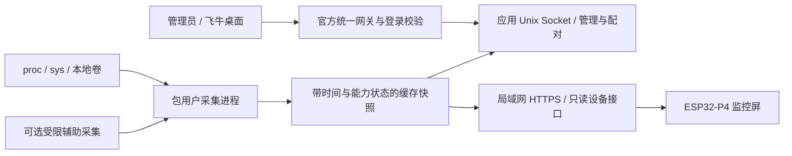

# 飞牛监控伴侣应用：官方应用中心方案

核查日期：2026-10-05。状态：**P1 已在开发机上实现（`fnpack build` 出包成功，本地端到端测试 143 项全通过）；P2 已完整实现——NAS 侧的遥测面 HTTPS、证书指纹信任与明文引导通道，板端的配对状态机、指纹固定、NVS 凭据与配对界面（固件 `./idf.sh build` 通过，主机预览样张与断言全通过）。P3 的本地可做部分（秘密扫描、通用发布构建验证、服务侧长跑、跨语言字段契约检查、烧录前栈预算检查）已完成。**尚未在真 NAS 上安装、尚未做过两台真机对上的配对实测，未申请上架，未联系官方。

## 这份文档现在有目录了（以及为什么需要）

它已经长到 838 行，而且是**按轮次追加**长的——第 5 行往下是三十来节"做的时候发现了什么"，而**方案本身（决策 / 数据来源 / 服务结构 / 实施阶段与验收）被推到了 700 行之后**。你自己要在装机前去翻它，翻到的会是一堆排查记录。

所以加了一份**目录**，并明确分成两部分：第一部分是方案，第二部分是按轮次追加的工程记录（只增不改）。**没有搬动正文**——搬 500 行的风险（这份文件没进 git，没有回退）大于收益，而目录已经把"去哪儿找"说清楚了。

目录本身也接进了 `plan_check.py`：**每一条目录链接都必须有对应标题**，标题改了名而目录没跟着改就会报。证伪：把「服务结构」那条链接的锚点末尾多加一个字母，检查当场报「目录里的链接……没有对应的标题」。现在共 13 条链接。

（写这段时又踩了一次第 11 轮那个坑：**把证伪用的字面量写进了文档**，脚本立刻把它们当成真的目录链接报错——两处，一处是那句举例、一处是描述用的占位写法。改法同上次：**改文档，不给检查加特例**。检查脚本里的特例越少越好，特例就是它开始装看不见的地方。）

## 目录

这份文档分两部分：**第一部分是方案本身**（要做什么、为什么这样做、验收标准）；**第二部分是实施进展与工程记录**，按轮次追加、只增不改——那里记的是「做的时候发现了什么」，读方案的时候不必看。

**方案**

- [决策](#决策)
- [当前基础与缺口](#当前基础与缺口)
- [数据来源](#数据来源)
- [服务结构](#服务结构)
- [配对与用户流程](#配对与用户流程)
- [协议与固件改造](#协议与固件改造)
- [FPK 交付](#fpk-交付)
- [实施阶段与验收](#实施阶段与验收)
- [上架与发布边界](#上架与发布边界)
- [官方来源](#官方来源)

**设计与实现细节**

- [P2 实现：遥测面 HTTPS 与证书指纹信任](#p2-实现遥测面-https-与证书指纹信任)
- [首次取证书通道（明文 bootstrap，只放行一个端点）](#首次取证书通道明文-bootstrap只放行一个端点)
- [P2 板端实现：配对、指纹固定与凭据存储](#p2-板端实现配对指纹固定与凭据存储)

**实施进展与工程记录**（按轮次追加，从旧到新；最近的在最后）

想快速看「哪些是验收过的」，直接读 `docs/fnos-companion-test-report.md`——那份是生成的，每一行都真的跑过。


## 实施进展（本地，2026-10-05）

包源码在 `nas/fpk/nasscreencompanion/`，产物是 `nas/fpk/nasscreencompanion.fpk`（83741 字节）。构建与测试：

```sh
export PATH="$HOME/.local/bin:$PATH"          # fnpack 装在这里
nas/fpk/test_lifecycle.sh                     # 打包 + 按真机布局解开 + 走完整生命周期（143 项）
bash tools/test_report.sh                     # 跑一遍并生成 docs/fnos-companion-test-report.md
python3 nas/fpk/mem_check.py                  # 每请求内存判定：RSS 是平台化还是单调上涨
python3 nas/fpk/contract_check.py             # 板子读的字段，NAS 侧是不是都在
python3 nas/fpk/board_sim.py --host <NAS> --port 8798 --pair-code <码>   # 板子动作序列（含 TLS 固定）
python3 nas/fpk/wizard_check.py               # 安装向导表单 schema
python3 nas/fpk/manifest_check.py             # manifest 取值与包内结构（--strict 供上架前用）
node nas/fpk/page_check.js nas/fpk/nasscreencompanion/app/ui/www/index.html <响应.json>  # 管理页 JS
bash tools/release_check.sh                   # 固件侧通用发布构建 + 秘密扫描
python3 tools/stack_check.py                  # 烧录前的栈预算检查（见下节）
```

`python3 nas/fpk/contract_check.py` 也可以直接放进这条流水线（已在 `test_lifecycle.sh` 的 7c 阶段里跑）。

注意 `fnpack build` 把 `.fpk` 写在**当前工作目录**，不是写在 `--directory` 指向的目录里，所以要 `cd` 到目标目录再构建（`test_lifecycle.sh` 是在临时工作目录里构建的，不污染仓库）。

`test_lifecycle.sh` 会把 `fnpack build` 的产物解到临时目录里，复刻 `/var/apps/{appname}/` 的真实布局（`cmd/` 一套、`target/` 一套、`var/`、`etc/`），再依次跑安装、启动、改设置、升级、卸载，还有三件容易漏的事：旧固件依赖的 `/api/v1/status`、`history`、`health` 字段名与类型被写成了契约断言（`v=1` 保留、只允许加字段），端口被占用时应用不碰占用者，管理面 Socket 建不起来时遥测面仍然可用并给出警告。证书相关还有两条容易漏的断言：管理页显示的指纹必须等于 `openssl x509 -noout -fingerprint -sha256` 的输出（板子固定的就是这个值，算错等于信错证书），以及关掉 TLS 再打开后指纹必须完全不变（否则已配对设备会全部失效）。**143 项断言全部通过**（`0b`、`0c`、`0d`、`3b`、`4c`、`6b`、`7c`、`7d` 各阶段见下）。

已实现：`manifest`（`platform=x86`、`install_dep_apps=python312`、`service_port=8798`、`ctl_stop=true`、`checkport=false`）；`config/privilege` 用 `run-as=package`；`config/resource` 不声明任何共享目录；`app/ui/config` 走统一网关（`gatewayPrefix=/app/nasscreencompanion` + `gatewaySocket=app.sock`，`allUsers=false`）；`wizard/` 的 install/config/uninstall 三份表单；`cmd/` 下 9 个生命周期脚本（共用 `cmd/_common.sh` 前言）；`app/server/` 一个进程两个 HTTP 面（Unix Socket 管理面 + HTTPS 遥测面）；`app/ui/www/index.html` 单文件管理页（概览/能力矩阵/设备配对/服务设置/诊断五个标签页）。

四个容易再次踩到的坑，写在这里备忘：
1. **`TRIM_APPDEST` 指向 target 目录本身，不是包根。** fnOS 把 `app.tgz` 的内容直接解到 target 下，所以服务在 `$TRIM_APPDEST/server/`，管理页在 `$TRIM_APPDEST/ui/www/`，Socket 在 `$TRIM_APPDEST/app.sock`——不是 `$TRIM_APPDEST/app/server/`。开发机上直接对着包目录跑时才是带 `app/` 的那一层。`cmd/_common.sh` 和 `nas_companion_server.py` 现在两种布局都认，但新写的路径解析必须想到这一点。
2. **bash 在 UTF-8 locale 下会把 `$VAR` 紧跟的多字节字符当成变量名的一部分**，报 `W_PORT?: unbound variable`。shell 脚本里变量后面紧跟中文时一律写 `${VAR}`。
3. **走 TLS 时 HTTP 响应会被拆成多个 TLS 记录，只 `recv()` 一次往往只拿到响应头。** `cmd/_common.sh` 的就绪探测因此改成循环读到出现 `"ok"` 为止。明文下碰巧一次读全，所以这个坑只在启用 TLS 之后才暴露——当时的症状是"服务明明起来了，`main status` 却判定启动失败"。写任何"连上去读一次判断服务活着"的代码都要注意这一点。
4. **本地跑一次服务，Python 就会在包目录里写下 `__pycache__`，而 `fnpack` 会把它原样打进 `.fpk`**——曾经真的发出去过（包因此从 67 KB 涨到 90 KB）。现在三处都堵上了：`.gitignore` 忽略、`cmd/main` 启动时带 `PYTHONDONTWRITEBYTECODE=1`（不在 target 里落缓存）、`test_lifecycle.sh` 打包前清一遍。第 `0b` 阶段会断言包里不含 `__pycache__`/`.pyc`/`.DS_Store`。

另外两个 manifest 字段是有意偏离默认值的，改动前请先读理由：`checkport` 设为 `false`，因为端口是用户在向导里可改的，而 `checkport` 检查的是 manifest 里写死的 `service_port`——用户把端口改到别处之后，这个检查会拿一个已经不适用的端口去拦启动。端口冲突改由 `cmd/main start` 和 `cmd/install_init` 检查，它们读的是 `config.json` 里实际生效的端口（本地测试第 11 项就是验这个：端口被占用时干净报错，不碰占用者）。`platform` 写 `x86` 而不是 `all`：包本身只有 Python、HTML 和 shell，形式上够 `all`，但按本方案的验收口径，没在 ARM 上装过就不声明支持，等真机验证过再放宽。

P0 的权限矩阵没有停在文档里：`fnos_collector.py --probe` 是它的可执行版本，管理页的「能力矩阵」标签页就是它的输出（逐项列出来源路径、可读状态、包用户 uid）。真 NAS 上跑一次 `python3 fnos_collector.py --probe` 即可拿到包用户视角的实测结果，这一步仍待做。

## 板子读的字段，NAS 必须都在（跨语言契约检查）

固件用 cJSON **按字段名**取值，取不到就是 0 或空字符串——不报错、不打日志、界面上只是那个指标一直是 0。NAS 侧把 `load1` 改名成 `load_1`，板子不会有任何反应，只会安静地显示错的东西。`7b` 阶段钉住了顶层字段与类型，但**段内部的字段名**（`cpu.load1`、`vols[].mnt`、`raid[].sync_pct`……）一直没人管。

`nas/fpk/contract_check.py` 补上这一块，做法是**不手抄清单**（手抄的清单一定会过期），而是从 `components/fnos_monitor/fnos_data.c` 现抓固件读了哪些字段——包括处理两个容易抓错的地方：C 局部变量名不等于 JSON 段名（`const cJSON *raids = ...("raid")`），以及数组里的 `it` 要归属到最近一次 `cJSON_ArrayForEach`。然后逐项核对：本机拿得到数据的段对着**真实响应**核，拿不到的（macOS 没有 `/proc`、`/sys`）退回采集端源码核键名，另外所有字段都要求"这个名字在采集端代码里至少存在过"。

**推荐拿真 NAS 的一帧来核对**（配好对之后在任意一台机器上就能做，不用往 NAS 上拷东西）：

```sh
TOK=<管理页「设备配对」拿到的令牌>
curl -s --cacert server.crt -H "Authorization: Bearer $TOK" \
     https://<NAS>:8798/api/v1/status > /tmp/status.json
python3 nas/fpk/contract_check.py --status /tmp/status.json
```

真 NAS 上每个采集段都有真实数据，62 个字段会全部走"对着真实响应核对"，不留任何靠源码猜的条目。也可以直接把 `contract_check.py` 和 `board_fields.json` 拷到 NAS 上、用 `NSC_COLLECTOR` 指向采集器运行（`board_fields.json` 是 `--emit` 生成的随包清单，改了固件读的字段就重新生成一次，清单变化本身就是一次可 review 的 diff）。这个检查第一次跑就抓到一个真问题：`_cpu()` 在 `/proc/stat` 读不到时的兜底返回值里**漏了 `runq`**，字段形状在两条路径上不一致——真 NAS 上走不到那条分支，但任何受限环境里都会静静地少一个字段。已给 `nas/fnos-agent.py` 和随包的 `fnos_collector.py` 都补上，并在一个真实 HTTPS 响应上复验过（补之前那次响应里没有 `runq`、检查报错；补之后有了、检查通过）。检查本身也做了反向验证：把采集端的 `raid.sync_pct` 改名、以及往固件里加一个 NAS 根本没有的字段，两种情况都会被抓出来。

## 板子上那串指纹，和 NAS 上那串，是两段独立的代码算的

指纹是整套信任模型里**唯一的人工锚点**：用户在 NAS 管理页看一串、在板子屏幕上看一串，逐段比对，一样才放行。而这两个值由**两段完全独立的代码**算出来——服务端是纯 Python（`pem_fingerprint()`：PEM 第一段证书的 base64 正文 → sha256 → 大写冒号分隔），板端是 `components/fnos_monitor/fnos_pair.c` 里的 C 版（`mbedtls_base64_decode` + `mbedtls_sha256`）。**算法只要有一处不一样，用户就会看到两个不同的值，而且怎么都对不上**，现场完全无从判断是证书问题还是代码问题。

`tools/certcheck/run.sh` 把这件事变成可验证的：

- 为了让"测的确实是固件那份代码"，**不抄一份函数**，而是 `tools/certcheck/extract.py` 从 `fnos_pair.c` 里把 `pem_fingerprint()` 原文抠出来编译（抠出来的文本旁边留一条 sha256，改一行就能看出来），两个文件级缓冲的尺寸也照抄（宏名查成数值）。
- mbedtls 用 ESP-IDF 自带的源码编到主机上（`base64.c` + `sha256.c` + `platform_util.c`，**不写替身**——连 base64/sha256 的实现都跟板子上是同一份）。
- 三方对照：固件那份 C 代码 / 服务端 Python 那套 / `openssl x509 -noout -fingerprint -sha256`。另加两个边界：**CRLF 换行的 PEM**、**PEM 里带证书链**。

第一次跑就抓到一个真 bug：**两段证书时固件返回 false**。原实现把**每一段**的 base64 都拼起来，链一长就撑爆 `s_b64[2048]`；而服务端是"只取第一段"。真机上用户只会看到「证书解不开，没法核对指纹」——一句完全指错方向的提示。已改成两端都由构造只认第一段（循环里遇到 `-----END` 就 `break`）。现在三方一致、CRLF 一致、两段也只认第一段。

同一个脚本还顺带暴露了另一件事：`fnos_ui.c` 里留着一个上一轮排查用的调试函数（`fnos_ui__debug_pair_buttons`），它调 `lv_obj_get_local_style_prop` 时**少传一个 selector 参数**，固件根本编不过——而它加进来之后固件从没编过（`build/fnos_monitor.bin` 的时间戳比 `fnos_ui.c` 早了 7 分钟）。**调试脚手架留在生产源码里，代价就是编译期才炸。** 已经连同 `preview.c` 里的调用一起删掉。

## 别直接跑 `fnpack build`：它会把这个也打进去

`fnpack build` 把包目录里的**一切**塞进 `app.tgz`。开发机上一旦有人用源码树里的脚本跑过服务端（`nas_companion_server.py:53` 有 `from fnos_collector import (...)`，而 `nas/fpk/mem_check.py:41` 就是 `importlib` 把它加载进本进程跑的），Python 就会在 `app/server/__pycache__/` 留下 `.pyc`——**本机 Python 3.14 的字节码，而 NAS 上跑的是 python312**。直接打出来的包会凭空多出约 61 KB 的无用字节码（实测 67754 → **128723**）。

**为什么一直没人发现**：测试套件的 `0b` 阶段**早就有**这条断言（`! grep -qE '__pycache__|\.py[co]$'`，输出「包里没有 Python 字节码缓存」），但套件是**先清理再构建**、而且只检查它自己刚打出来的那个包——**被漏掉的恰恰是留在磁盘上、要交到你手上的那一个**。检查覆盖了流水线内部，没覆盖交付物。

三处一起修：

- `nas/fpk/mem_check.py` 顶部 `sys.dont_write_bytecode = True`——**别让检查工具污染要分发的包**。
- 新增 **`nas/fpk/build.sh`** 作为打包的唯一入口：先清 `__pycache__`/`*.pyc`/`*.pyo`/`.DS_Store`，再 `fnpack build`，打完**立刻**扫一遍产物（`__pycache__|\.py[co]$|\.DS_Store|^\._`），命中就非零退出。打的是"产物"，不是"构建过程"。
- 顺手把多字节变量名的 lint 从 `cmd/` **扩到 `tools/*.sh` 与 `nas/fpk/*.sh`**（这个坑在构建脚本、报告脚本、certcheck、`build.sh` 里各踩过一次）。扩完立刻在 `test_lifecycle.sh` 自己身上抓到两处（`$pat→`、`$NDEV 台`）——**检查范围本身也会漏**。

## 计划文档自己也有人核

这份文档既是要给人读的方案，也是 P4 上架材料的一部分，而它会随着实现不断变长（现在快 400 行）。**过期的数字比没有数字更糟**——读者不会去核对"那段写的字段数"到底对不对，只会照着它做判断。

`tools/plan_check.py` 把三类最容易过期的声明变成可执行检查：

- 文档里反引号引到的**路径**必须真的存在（包内相对路径 `app/ui/config`、仓库相对路径 `tools/stack_check.py` 都认，`icon_{32,64,128,256}.png` 这种花括号写法会展开再查）；
- 提到的**字段数**必须等于 `nas/fpk/board_fields.json` 的实际条目数；
- 提到的**包大小**必须等于 `.fpk` 的实际字节数；
- 提到的**断言条数**必须和 `docs/fnos-companion-test-report.md` 里那次真实运行一致（报告本身是生成的，所以这是一条从文档→报告→实测的闭环）——而且报告里只要有失败项就直接报错，"文档很好看但测试是红的"这种情况过不去。

两条证伪都中：把字段数改回加 `ts` 之前的旧值，检查立刻报「文档写的字段数与 `board_fields.json` 实际值不符」；把某个工具名改错一个字母，报「文档提到的工具不存在」。

（这里刻意不写出那两个错误值本身——写出来它们就成了文档里的新字面量，而这个脚本是拿字面量去核对的，等于给自己埋假阳性。**检查脚本里的特例越少越好，特例就是它开始装看不见的地方。**）

它就是靠这个抓到自己的一处过期：加了 `ts` 之后契约检查的条目数变了，而文档里那句「N 个字段会全部走"对着真实响应核对"」没人会注意到。

### 一次偶发失败，连跑七次才逮到

生成报告时套件报过一次 **130 通过 / 1 失败**，紧接着连跑两次都是 **131 / 0**，而 `test_report.sh` 把套件日志写在临时目录里、跑完就删了——**没留下是哪一条**。（已改成：套件报红时把日志拷到 `/tmp/nsc-suite-failed.log` 并把红的几条贴出来。）

留了日志之后连跑七次，逮到真凶：

```
✗ ?n=1 给的是最新那一行（期望 1791205534，实际 1791205533）
```

**是断言自己的问题**：它拿**两次独立请求**的"最后一行 ts"去比，而采集端每 1 s 追加一行——两次请求之间正好落进一个新样本时，全量那次就比 `?n=1` 那次新一行。改成"`?n=1` 的 ts 必须是全量结果**最后两行之一**"（允许中间多出一行），连跑五次全绿。

**偶发红的检查会让人开始忽略红**，所以这条值得花时间逮——而不是记一句"大概是时序问题"。

### 试着把 CN/到期也拉进来，结论是"不值当"

配对屏上跟指纹并排显示的还有 **subject（CN）与到期日**——同一屏、同一次比对。既然指纹能在设备外验，CN 与到期按理也该能。

试了，**结论是撤回**：`cert_info()` 依赖的是 mbedtls 的 **x509 整套**（`x509_crt.c`/`asn1parse.c`/`oid.c`/`pkparse.c`/`pk.c`/`bignum.c`…），不是 certcheck 现在编的 `base64.c`+`sha256.c` 两个文件。为它把整个 `library/` 编到主机，收益是一个**只做格式化**的函数：

```c
snprintf(until, until_cap, "%04d-%02d-%02d", crt->valid_to.year, crt->valid_to.mon, crt->valid_to.day);
```

subject 与到期日都是 mbedtls 解出来的，我们这边只是拼字符串。它的风险集中在**编译期**，而那一层已经踩过了（`mbedtls_x509_time` 的字段是 `day` 不是 `mday`）。所以这一半**明确留作真机比对**，不假装置换了。

**但过程里修掉一个真 bug**：`extract.py` 原来用非贪婪正则 `\{.*?\n\}` 切函数体，遇到**嵌套花括号**会停在第一个内层块的收尾行上——`cert_info()` 里那个 `if (!crt) { … }` 就正好踩中，抠出来的东西少一半（报 `use of undeclared identifier 'crt'`，看起来像类型问题，其实是"函数被切了"）。已改成按花括号**配对计数**切。**这个修复留下了**：以后要抠任何带嵌套块的函数都不会再静默少一半。

### 历史回填那一半也补上了，而且第一次断言写得太松

`parse_history()` 同样从没在设备外跑过，而且刚改过 `?n=` 协议，所以一起拉进 `tools/parsecheck`：抠出 `parse_history`，`extract.py` 的替身段补上 `s_seq` / `s_status` / `s_lock` 与 `pdTRUE`/`portMAX_DELAY`/`xSemaphoreTake`/`ESP_LOGI`（**顶掉的只是"锁"和"日志"这两件主机上不存在的事，解析逻辑本身是原文**；真机上它在持锁状态下写，这里单线程跑，语义等价）。

喂 300 行、间隔各 1 s 的历史，实测 `n_seq=300 ts_ok=1 span_s=299 gap_x10=10`——**曲线横轴那套时间语义（`hist_span_s` 换算成"最近 N 分钟"、`hist_avg_gap_x10` 判断中间有没有断流）算对了**。

**但第一版断言只写了 `span_s > 0`**，证伪时把 `ts_last - ts_first` 改成 `ts_last`（跨度变成一个一亿多的数）**照样通过**。改成让 `run.sh` 从**同一个生成器**算出期望值传进来、main.c 比精确值之后，两条证伪才都中：

```
BADHIST span_s=1791200299（期望 299）gap_x10=10（期望 10）
BADHIST span_s=299（期望 299）gap_x10=9（期望 10）      ← 平均间隔写成 n 而不是 n-1
```

第二条尤其值得留：`/ n` 与 `/ (n-1)` 差一个数，界面上的"平均间隔"和"有没有断流"就都偏了，而**看日志完全看不出来**。

## 板子那个解析函数，从来没在设备之外跑过

`contract_check.py` 只核对**字段名在不在**；没有任何检查验证板子**能不能真的解析**那一帧。而 `parse_status()` 是固件里跑得最勤的一段代码（每秒一次），**却从来没在设备之外执行过**——主机预览把 `fnos_data` 整个换成了替身。

做法和 certcheck 一致：`tools/parsecheck/extract.py` 从 `fnos_data.c` 里**原样抠出** `jstr/jnum/jint/jbool/parse_status`（附 sha256），`main.c` 喂它一份**满载**样本——样本由 `make_payload.py` 按**两边上限里较小的那个**生成，cJSON 用工程里那一份。

第一次跑就通过，而且给出了几个只有跑起来才看得见的事实：

- **8251 字节的满载帧能解析**，各段计数与上限一致（12 卷 / 8 阵列 / 10 磁盘 / 24 温度 / 16 容器 / 8 告警 / 9 模块）。
- 字符串确实会被截断：`temp0=coretemp-is`（`n[12]`）、`alert0=critica`（`lv[8]`）——这些都在预期内，NAS 那边本来也只发这么长的值。
- **但告警正文被切成了半个汉字**：`凑�`。`fnos_alert_t.m[60]` 装不下中文长句时，`jstr()` 的 `strncpy` 会切在多字节字符中间，屏幕上就是豆腐块或乱码——**而且看不出是"被截断"还是"数据本身坏了"**。

实际的告警文案全是 ASCII 模板（`"%s used %.0f%%"`、`"container %s down"` 等，最长 37 字节），所以现在撞不上。但 **NAS 那边只要有人往里塞一个中文，这里就会静静烂掉**。

所以顺手把 `jstr()` 改成**不切断多字节字符**（切点落在续接字节 `10xxxxxx` 上就往前退到字符边界），并在校验器里加了一条：**截断过的每个字符串都必须是合法 UTF-8**。

证伪：退回 `strncpy` 写法 → `BADUTF8 field#10: E4 B8 80 E4 B8 AA …` + `utf8=FAIL`，整个检查失败。

**教训**：有些东西只有在**真的把它跑起来**之后才会露出来。"字段名都在"和"能解析"之间隔着一整个函数。

## 满载的时候，状态帧本身就装不下

上一轮把六段的上限都对齐之后，顺手算了一下**最坏情况**：各段都到上限时，`/api/v1/status` 的 payload 有多大？按每项的实际字段长度构造一个满载样本，`json.dumps` 出来 **8289 字节**——而板子的 `RX_BUF_SIZE` 是 **8192**。

**装不下。** 后果和前面那些"静默少数据"不一样，这次是**整个状态帧解不出来**：截断的 JSON → `cJSON_Parse` 失败 → `parse_status` 返回 false → 轮询被判为失败 → 板子上一直显示「**NAS 返回的数据解析不了**」，而 NAS 那边一切正常、日志干干净净。

而且**上一轮把上限放宽（8/6/10 → 12/8/24）正好让它更容易撞上**。一台 12 个卷、24 个温度传感器、16 个容器的机器很常见。

修法：`components/fnos_monitor/fnos_data.c` 的 `RX_BUF_SIZE` 从 `(8 * 1024)` 改成 **`(24 * 1024)`**（这块本来就在 PSRAM 里，约 3 倍余量）。

检查也补上了：`contract_check.py` 按两边声明的上限把满载帧重算一遍（每项字节数是**量出来的**：vols 110 / raid 90 / disks 60 / temps 45 / docker 95 / alerts 250，固定段 1500），要求 `RX_BUF_SIZE` 大于它。现在报 `RX_BUF_SIZE=24576 ≥ 满载估计 8740`。证伪：改回 8 KB →

```
✗ RX_BUF_SIZE=8192 装不下满载的状态帧（按声明的上限估 8740 字节）
  —— 会被截断，板子会一直显示「NAS 返回的数据解析不了」
```

**这一轮和上两轮是同一个教训的第三次**：两端各写各的数字，谁也不知道对方能装多少。区别只在于掉的是**一段数据**还是**整帧**。

## 还有三段根本没截断：卷、阵列、温度

上一轮查历史长度时顺手把六段都过了一遍，发现**卷 / 阵列 / 温度这三段压根没有截断**——NAS 有多少发多少，而板子的定长数组只有 8 / 6 / 10。多出来的部分在板子上**静默丢掉**，界面上就是"只有这么多"。

温度最容易撞：现代主板 + NVMe + 硬盘，传感器很容易超过 10 个。板子的定长数组本来就是按"够用"拍的，没人核过它和 NAS 的上限。

改法沿用上一轮那套：

- 板子容量放宽到 **vols 12 / raid 8 / temps 24**（PSRAM 多花约 520 字节）。
- `DEFAULT_LIMITS` 补上这三段，`trunc.limits/totals/dropped` 也从三段扩到六段。
- 顺手把六处截断**收成一个 `_trim(name, seq)`**：以前是三处硬编码（`rates[:10]`、`result[:16]`、`out[:8]`）、三处没有——硬编码的那三处一旦有人改了 `DEFAULT_LIMITS` 就会和声明对不上。

### 但"声明"和"实际做了"是两件事

`contract_check.py` 比的是 `DEFAULT_LIMITS` 这个**常量**和板子的数组容量；套件里那条 `trunc.limits` 断言查的是**声明**。**证伪时把 `vols` 的截断去掉，两个检查都是绿的**——声明还写着 12，实际却有多少发多少。

而这类事在本机**测不出来**：macOS 上只有一两个卷、零个阵列、零个温度传感器，**数量本来就低于上限**，裁不裁看起来一模一样。（同一个空断言陷阱，这个项目里已经踩过四次了。）

所以新增 `nas/fpk/collector_check.py`：绕开真实数据，直接给 `_trim()` **喂 50 条合成数据**，六段逐个比"裁完的条数"和"记下的总数"；再**静态核一遍六个调用点都真的走了 `_trim()`**、没有漏网的硬编码截断。

两条证伪：把 `_trim` 里"记总数"挪到截断之后 → 六段全报「记的总数是 16，应当 50 —— `trunc.totals` 会报错数」；把 `vols` 的调用点改回 `return vols` → 「vols 没有走 `_trim()` —— 上限声明得再漂亮也不会被执行」。

**第二次证伪才是关键那一次**：第一版检查直接调 `_trim`，调用点改坏了它照样全绿。

## 用户能配的历史长度，超出了板子能收的量

`hist_len` 在管理页可以配到 **3600**，而板子的 `HIST_BUF_SIZE` 只有 **32 KB**：

| | |
| --- | --- |
| NAS 允许 | 最多 3600 行，约 **151 KB** |
| 板子接收缓冲 | **32 KB** |
| 板子内部环形缓冲 | `FNOS_HIST_MAX` **600** 格 |

后果不是崩溃，而是**静默失效**：超出的部分被截断 → JSON 解不出来 → `parse_history` 返回 false → `hist_done` 保持 false（代码注释写着"失败下一轮再试，别静默放弃"，本意是好的）→ **每秒重试一次、曲线回填永远不成功**，而界面上只是"趋势图少了一段历史"。用户是自己去设置页改的那个值，改完没有任何提示。

**两处一起修**：

- **板子声明自己能收多少**：`/api/v1/history?n=FNOS_HIST_MAX`。它自己的环形缓冲就只有 600 格，多要也没用。
- **NAS 照办**：`?n=` 只回**最近** n 行（曲线要的是靠后的一段），不带的客户端行为完全不变——**加字段、不改老行为**，和协议契约的要求一致。

套件新增 `7g` 阶段：`?n=10` 回 10 行、`?n=99999` 夹到实际行数、`?n=0`/`?n=abc` 退回全部、**`?n=1` 给的必须是最新那一行**。两条证伪都中：让 NAS 忽略 `n` → 「`?n=10` 只回 10 行（现在总共有 31 行）（期望 10，实际 31）」；让它取最早 → 「`?n=1` 给的是最新那一行（期望 …443，实际 …434）」。

**这条测试第一次也是空断言**：实例只有 3 行时，"`?n=10` 回了 3 行"既可能是正确夹取、也可能是 NAS 根本没理会 `n`——**两种实现长得一模一样**。所以现在先 `interval=0.2` 攒够样本、并**把"攒到 ≥10 行"本身断言出来**。这已经是这个项目里第三次踩同一个坑（`hist_len` 那次、`?n=` 这次），规律很清楚：**一个"上限"类的断言，必须先让数据超过那个上限，否则它什么也没说。**

另外给 `contract_check.py` 加了一条**板子内部**的不变式：`HIST_BUF_SIZE ≥ FNOS_HIST_MAX × 48 + 512`（现为 32768 ≥ 29312）。证伪：把接收缓冲缩到 16 KB → 「装不下 `FNOS_HIST_MAX=600` 行……会被截断，板子会每秒重试一次、曲线回填永远不成功」。

（坑：`FNOS_HIST_MAX` **不是** `FNOS_MAX_*` 那一族，通用正则抓不到它，得单独取。）

## 整个方案压在一个假设上：`TRIM_APPDEST` 到底是哪一层

包里的服务要放对地方、Socket 要放对地方、管理页要能被网关照到——**全都依赖"`app.tgz` 解开之后落在哪"这一个假设**。前面几十轮里，它是被我"从文档推断出来"的，而测试套件复刻的也是我这个推断：**推断错了，套件会跟着一起错，而且是全绿地错。**

回头把官方原文逐条挖出来对了一遍，结论是**有原文直接背书，不是推断**：

- 环境变量文档（`env.txt`）原话：**「`TRIM_APPDEST`：已安装的 target 目录。」**——就是那一层，不是它的上一层。
- 统一网关文档（`gateway.txt`）把路径写死了：「飞牛 fnOS 将请求转发到 **`/var/apps/myapp/target/app.sock`**」，「Socket 文件应放在已安装应用的 **target 目录**下。脚本中可使用 `${TRIM_APPDEST}` 定位该目录。」两句话把 `/var/apps/{app}/target` 与 `${TRIM_APPDEST}` 划了等号。
- 因此 `fnpack` 把 `app/` 的内容打进 `app.tgz`、系统把它解到 target，服务就在 `${TRIM_APPDEST}/server/`、页面在 `${TRIM_APPDEST}/ui/www/`、Socket 在 `${TRIM_APPDEST}/app.sock`——和 `cmd/_common.sh` 里 `TARGET="${TRIM_APPDEST:-…}"`、`SOCK_FILE="$TARGET/app.sock"` 以及服务端 `app_dest()` / `socket_path()` 完全一致。

其余几个路径也对了一遍，与文档的措辞一一对应：`TRIM_PKGVAR`「运行时数据目录」（`PKG_VAR`、`INFO_LOG`）、`TRIM_PKGETC`「应用配置目录」（`PKG_ETC`）。

**这件事值得单独记一笔**：它是全项目里唯一一个"错了就全错、而且本机测不出来"的假设，而在此之前它只在文档里以推断的形式出现过一次。现在原文和结论都在这里，下一个动手的人（或真机上第一次失败的我）可以直接对着它查。

## 静态检查看不见"没说出口的问题"

前面那一堆检查有个共同点：**它们只看得到我问得出问题的地方**。而有一类问题根本没人问——未关闭的 socket、未关闭的文件、弃用调用：单次请求看不出任何异常，跑一天就是句柄耗尽。

一次全扫的结果：

- **编译器零警告**：`touch components/fnos_monitor/*.c main/main.cpp` 后全量重建，`warning:` 一条都没有。
- **运行时零警告**：服务端在 `python3 -X dev` 下跑 180 次请求（管理面 / TLS 面 / 明文引导面各 60 次），输出 67 行，**零 `Warning`**。

第二项固化成了 `nas/fpk/devmode_check.py`：按真机布局摆好包、用 `python3 -X dev` 起服务、三个面各打若干次、断言输出里零 `Warning`。证伪：在 `do_GET` 里故意漏一个未关闭的 socket → 当场报 `ResourceWarning: unclosed <socket.socket fd…>`。

写它的第一版也翻了个车，值得记：环境变量我用了 `W_PORT`，而**向导字段名是小写的 `wizard_*`**——`norm_wizard()` 会从 `${wizard_port:-…}` 重新算出 `W_PORT`，直接塞 `W_PORT` 会被覆盖，服务于是去监听默认的 8798、报"端口已被占用"退出。而当时脚本只打印一句「服务端中途退出了」，**看不出真正原因**。已改成把服务端最后几行原话带出来。**一个检查报错时报不出原因，等于没报。**

（顺带发现一条真实但无害的路径：遥测端口绑定失败退出时，已经建好的 Unix socket 不会被关闭——`-X dev` 下会看到 `ResourceWarning: unclosed … laddr=…/app.sock`。进程随即退出、OS 会回收，且残留的 socket 文件下一次启动有 `cleanup_socket()`/`server_bind()` 的 unlink 兜着，所以没有实际后果，先记着。）

## "服务侧长跑已完成"这句话，之前靠肉眼看日志

状态行里写着 P3 的本地可做部分包含「服务侧长跑」已做完。而这件事一直靠我**每轮扫一眼 `/tmp/nsc-soak.log` 的尾部**——第 18 轮就吃过一次亏：那个跑了十几个小时的实例，跑的其实是一份**被破坏过的副本**（做证伪时把引导守卫临时改成 `return False`，还原了源码，但 `/tmp/nsc-soak/` 里的拷贝没还原）。日志每一行都漂漂亮亮地写着「管理面=200 TLS=200 明文引导=200」——**它只是一直在测旧的、坏的那份代码**。

`tools/soak_check.py` 把它变成一次检查，查四件事：

1. **在不在跑**（没跑就如实说「未在运行」，不算失败——它不是交付物，但它意味着这一条**现在没有证据支撑**）；
2. **跑的是不是当前代码**——暂存副本与源码**逐字节比对**（`nas_companion_server.py` 与 `fnos_collector.py`）；不一致就直接报"这些采样测的是旧代码"，并提示重启；
3. 最近三次采样两面是否都答得上来；
4. 句柄有没有涨、内存有没有爬（判据与 `mem_check.py` 同源）。

**第一次跑就抓到了同一个坑的第二次**：`54331 vs 54944 字节`——我在第 24/25 轮改过服务端（`ConfigError`、`set_hist_len`），而长测还是上一次重启时的那份。已重启并让它跑当前代码。

证伪：往暂存副本里塞一行注释 → `✗ target/server/nas_companion_server.py 与源码**不一致**（54971 vs 54944 字节）—— 这些采样测的是旧代码`；删掉那行即恢复通过。

## 报告只跑了 NAS 那一半

上一轮修掉那行硬编码之后，顺着同一个问题往下问：**方案文档的状态行里还写着「主机预览样张与断言全通过」，而报告根本没跑过预览。** 又是一次"报告替没跑过的检查背书"，只不过这次连那一行都没有——它压根不在表里。

现在 `test_report.sh` 会跑 `bash tools/preview/run.sh`。它同时是四条版面审计（字形覆盖 / 标签溢出 / 子对象越界 / 可点击控件压盖）的入口，加上 11 条连接失败原因的渲染断言与整套配对流程断言——**"用户根本看不见"这类问题的唯一拦截点**。

证伪：把「关闭」按钮挪到卡片外（`x=1200`）→ 报告当场变红，**并且贴出了审计原话**：

```
✗ 主机预览（四条版面审计 + 配对流程断言）
    child out of parent: "?" child=[1289,523]-[1448,574] parent=[88,64]-[1011,585]
    tools/preview/run.sh: line 58: Abort trap: 6   ./build/preview "$OUT"
```

这正是第 22 轮给 `run_check` 加"失败时贴最后三行"的用处——**红得能直接看出红在哪**，而不是让人再去翻日志。

## 报告里有一行是写死的"通过"

`docs/fnos-companion-test-report.md` 是生成的，但那张表里**有一行是硬编码的**：

```
| 通用发布构建 + 秘密扫描 | … | 通过（全量构建约 2 分钟） | bash tools/release_check.sh |
```

**它从来没有被跑过。** 生成的报告替一个没执行过的检查背书——这和我这几轮一直在修的那些"看起来成功、其实没做"是同一类东西，只不过这次说谎的是我自己的报告。

两处改动：

- **默认如实写**「**本次未运行**（要两三分钟）——跑 `bash tools/release_check.sh` 或 `bash tools/test_report.sh --full`」。
- **`--full` 真的跑**，把结果写进那一行（通过 / 失败，失败时还贴出最后三行）。跑完确认过 `components/fnos_monitor/fnos_config.h` 被 trap 还原（443 字节）。

顺带把这次补跑的结论记下来：**通用发布构建现在是通的**——`fnos_pair.c` 那套新增代码没有依赖本地配置。产物 1790976 字节，SSID / 口令 / 令牌 / NAS 地址四项扫描全部「未出现」。这一项自第 3 轮之后就没再跑过，中间落了配对模块、TLS、字体等一大批改动，**跑之前它是不是还通，谁也不知道**。

## 向导六个字段，每一个都要真的落地

上一轮揪出"校验失败被当成保存成功"之后，顺手把**设置写入的那条路**整条钉住：`apply_config()` 是"传 7 个位置参数"的写法（`local py="$1" port="$2" bind="$3" auth="$4" docker="$5" interval="$6" tls="${7:-true}"`），**漏传或传错一个就会用默认值把它悄悄改回去**，而界面上看起来一切正常。

阶段 8 现在把六个字段一起改（`PORT2` / `local` / `pairing` / `docker=true` / `tls=true` / `2.5`），逐个比对 `config.json`；并加一条反向的：**向导管不着的 `hist_len` 不许被顺手抹掉**——用户是在管理页里改它的，一次"保存设置"不该把它带回默认值。

证伪：把 `apply_config()` 里 `"docker_enabled": (docker == "true")` 写死成 `False` → 「六个字段在 config.json 里都对得上（期望 OK，实际 **错的是 docker_enabled,interval**）」——**点名说是哪个字段**，而不是笼统一句"配置不对"。

（更早一次证伪是把 `bind` 写死，结果套件在阶段 4 就崩了、根本没走到这条断言。**证伪也要挑得准**：动一个只会影响目标断言的地方，否则测到的是别的东西。）

## 校验失败被当成"保存成功"报给了用户

新增的 `7f` 阶段里有三条从没验过的性质（配对限流、内网免令牌、历史长度）。第三条一开始就红了，而它红出来的东西比预想的大。

**现象**：把 `hist_len` 改成 20，管理页显示「已保存：hist_len 必须在 30~3600 之间」，行数一点没变。

**根因**：`_apply_config()` 的**校验失败**是把错误信息塞进第一个返回值的——而那个位置是 `changed`：

```python
return ["%s 必须在 %s~%s 之间" % (key, lo, hi)], []      # 旧写法
```

接口于是回 `{"ok": true, "changed": ["hist_len 必须在 30~3600 之间"]}`。管理页那边**本来就有** `if (r.error) return hint(..., true)` 的错误分支——但服务端从来不走它，于是错误信息被当成**字段名**，用**成功**的样式显示出来：「已保存：hist_len 必须在 30~3600 之间」。**用户看到的是保存成功，而设置没变。**

修法：加一个 `ConfigError` 异常，四处校验失败改成 `raise`，`/api/config` 接住回 **400 + `{"ok": false, "error": …}`**——前端那个错误分支这才真正用上。测试里加一条：超出范围的值必须返回 **400**，而不是 200。

证伪：把它改回 `return [...]` → 「超出范围的 hist_len 返回 400（不是"保存成功"）」（期望 400，实际 **200**）。

### 顺带修的一处，以及一次"我的证伪自己骗了自己"

`hist_len` 收紧时不会截断已经攒下的历史，要等下一次采样才知道。加了 `Collector.set_hist_len()`：改上限的同时把 `history` 一起收掉。

**但第一版证伪时它"通过"了**——因为测试用的采样间隔是 0.2 s，采样循环每 0.2 s 就会自己裁一次，**两种实现看起来一模一样**。把间隔先拉长到 5 s 再收上限，差别才显出来：不立刻截断的话，`hist_len=45` 之后仍然是 49 行。

**这件事的教训是**：证伪没红不等于改动是对的，也可能是**证伪本身测不出来**。要让"立刻"和"下一次"分得开，就得先把"下一次"推远。

## 重签证书这条性质，以及"生效时机"

两个排障 CLI（`--check-port`、`--tls-regen`）此前**一次都没跑过**。前者是 `cmd/install_init` 也在用的端口检测；后者是用户手册里写明的性质：**重签之后指纹会变，已配对设备全部失效**。既然写进了手册，就该验出后果，而不只是"命令能跑"。

新增 `7e` 阶段：`--check-port` 对占用/空闲端口分别返回 1/0；`--tls-regen` 之后磁盘上的指纹确实变了；**按旧证书固定必须握手失败、按新证书固定必须仍然可用**。

写这条时第一次就红了，红得有价值——我把断言写成了"重签之后立刻用新证书能连"，而实际是 **000**。原因：**证书是启动时加载的，重签只改磁盘上的文件，正在跑的进程手里还是旧证书**。于是顺手把"生效时机"也钉进了断言：

- 重签后**未重启**：拿旧证书仍然连得上（证明没有热换，也证明"重签"不会在你没准备的时候把在跑的服务弄断）
- **重启后**：旧证书 000、新证书 200

**还有一条纪律**：这一段动的是整个套件共用的证书文件，后面的阶段（比如 8b 的"关掉再打开 TLS 指纹不变"）拿 4b 时记下的指纹做比较。第一版没还原，8b 就在一个完全看不出关联的地方报红。现在 7e 结尾把证书与私钥都还原回去，并断言指纹已经回到原值。

证伪：让 `prepare_tls()` 忽略重签请求（`regen = False`）→「重签之后指纹没变（`--tls-regen` 没干活）」+「重启后：按旧证书固定必须握手失败（期望 000，实际 200）」。

## "返回 200" 不等于"干了活"

管理页那个阶段（6b）会把这些管理接口真调一遍，但**只把响应记下来喂给页面**，不断言结果——接口返回个错误它也照收。于是有几个接口从来没被要求过"真的生效"。

新增的 `6d` 阶段把它们的效果钉住：

- `/healthz` 别名可用；`/api/status-now` 返回的是状态快照而不是空壳；`/api/pairing/cancel` 可用。
- **容器开关点了必须真的生效**：打开 → `/api/state` 里 `config.docker_enabled` 变成 true；再关回去也要变回来。只断言"返回 200"是不够的——那正是"开关跳了、数据没变"的写法。
- **六个管理 POST（`/api/config`、`/api/pairing/{new,cancel}`、`/api/devices/revoke`、`/api/collector/docker`、`/api/shutdown`）在缺少网关身份头时必须全部 403**，非管理员（`X-Trim-Isadmin: 0`）改配置也必须被拒。这条是**逐个端点**跑的：漏掉一个就是"没登录也能改配置"，而漏掉的那个在页面上看不出来。

两条证伪都中：拆掉 `/api/collector/docker` 的身份校验 → 「六个管理 POST … 全部 403（期望 0，实际 1）」；删掉把开关写回 `st.cfg` 那一行（接口照旧返回 200 `{"ok": true}`）→ 「容器开关点了没生效」。

### 顺带：报告里红的那一项，现在会自己说原因

`tools/test_report.sh` 原来只打印 `✗ 每请求内存判定`，读报告的人还得自己去翻日志。现在失败时会把那一项的**最后三行**贴出来。起因是内存判定有一次短暂报红——有了这三行才一眼看出它其实是通过的，当时只是机器忙。

（`mem_check.py` 用的是 `port=0`（系统分配空闲端口），所以那次不是端口冲突；这也说明"偶尔红一下"的检查如果不把原因带出来，人只会开始不信任它。）

## 权限矩阵的每一格，来自一个纯函数

P0 要交的那张「来源 / 权限矩阵」，每一格都来自 `classify_read()` / `classify_statvfs()`。**判错的代价是方向性的**：把「权限不足」报成「不存在」，用户会去查驱动和硬件；反过来报，用户会去翻权限配置——两种都白折腾半天，而矩阵本身看起来一切正常。

本机是 macOS，测不了 NAS 上的**结论**（没有 `/proc`、`/sys`）；但分类器是纯逻辑，用临时文件树就能验：可读的文件、`chmod 000` 的文件（进程不是 root，EACCES 真的会发生）、不存在的路径、`chmod 000` 的目录。`nas/fpk/perm_check.py` 就是这些。

证伪：把 `PermissionError` 与 `FileNotFoundError` 两个分支的返回值**对调** →

```
✗ 无权限 → 判成了 missing，应当是 denied
✗ 不存在 → 判成了 denied，应当是 missing
✗ 目录无权限 → 判成了 missing，应当是 denied
```

**这正是最该被挡住的那种错**：矩阵会照常输出，只是每一格都在指错方向。顺带记一条：`classify_statvfs()` 单独判是必要的——`statvfs` 的权限模型和 `open()` 不一样（macOS 上 `chmod 000` 的目录仍能 `statvfs`），所以那个用例只断言"不崩、且落在合理状态里"。

## 说明书里补了"装不上、起不来怎么办"

`nas/fpk/README.md` 之前只写了"装上之后怎么用"，**没写装不上、起不来怎么办**——而那正是用户第一次接触它时最可能停住的地方，而且那时他还看不到管理页（诊断页也就用不上）。补了一节，按**用户看到的那句话**来查：

- **安装时被拦下**：端口占用（原文带上「本应用不会结束占用端口的进程」这句承诺）、`python312` 没装、8799 的提示（只是提示，不用处理）。
- **启动成功、但应用中心点开是空的**：这是"遥测面好的、只有管理面坏"的那一类，启动日志里会明说「应用中心里点开本应用会打不开……遥测接口不受影响」——**不用急着卸载**，开发板照常读数据。日志在 `@appdata/info.log`。
- **启动了但读不到数据**：逐条列出「诊断」页会报的项（网关 Socket、Socket 权限、遥测端口、鉴权模式、遥测面 TLS、首次取证书通道、运行用户、开发版端口 8799）。
- **「进程存在但端口无响应」**：`main status` 的退出码 1 是什么意思。

写的时候 `plan_check.py` 又拦了我一次：`<安装卷>/@appcenter/...` 这种**占位写法**被当成路径去核对了。改的是检查（带 `<`/`>` 的反引号片段当占位、不当路径），不是改文档。

## 被强杀之后还能不能干净重启

真机上很常见：OOM killer、掉电、应用中心里强杀。进程没了，但 `app.sock` 这个**文件**会留在 target 目录里。下一次 `bind()` 同一个路径就是 `EADDRINUSE`——而 `.sock` 是文件不是端口，用户看到的是**"管理页打不开"**，完全看不出问题在哪。

两层防线：`cmd/main start` 里的 `cleanup_socket()`（只删真 socket，`[ -S ]` 守卫），以及服务端 `UnixHTTPServer.server_bind()` 里的 `unlink`。测试套件新增 `5b` 阶段，从**用户路径**验一遍：`kill -9` → 确认 Socket 文件确实残留（前提成立）→ 照常启动 → 管理面与遥测面都要回来。

证伪：把两层都拆掉 → `管理面重新可用（期望 200，实际 000）`，而「强杀之后照常启动」**仍然通过**——因为 `cmd/main start` 按设计在管理面失败时也只警告、不返回错误。**所以这条阶段必须同时断言"启动返回 0"和"那一面真的能用"，只看退出码会漏掉它。**

（顺带：`start` 只报成功是不够的——这也是为什么启动后会检查 `[ ! -S "$SOCK_FILE" ]` 并额外 `warn`。）

## `board_sim.py` 现在也把"字段契约"跑在真 NAS 的真实响应上

装完包之后、接板子之前，最值得跑的那条命令是 `board_sim.py`。它原本只走配对链路，现在多了一步：**配对成功后顺手把这一帧真实的 `/api/v1/status` 交给 `contract_check.py`**，核对"板子读的 62 个字段，这台 NAS 是不是都给全了"。

这一步正是方案里 P0 的落地。在开发机上只有一部分字段能对着真实响应核（macOS 没有 `/proc`、`/sys`），其余只能退回采集端源码核键名；**真 NAS 上这 62 个会全部走真实响应**——那份"权限矩阵"就不再有任何靠猜的条目。结尾会直接给出下一步：`在板子上输入配对码，逐段比对指纹。`

### 顺带抓到一个"检查环境自己坏了"

第一次把这一步接上去跑，`board_sim` 报了一条红的：`明文读 /api/v1/status 被拒（403）（实际 401）`。

查下来不是源码的问题——**是那个跑了十几个小时的长测实例跑着一份被破坏过的副本**：我在第 6 轮做证伪时，把服务端 `_bootstrap_guard()` 临时改成 `return False`（等于去掉引导守卫），验完把**源码**还原了，但长测实例是在那之前从源码拷到 `/tmp/nsc-soak/` 的，**那份拷贝没被还原，一直跑了十几个小时**。

两件事值得记：

- 断言抓的是**行为**而不是"我以为的环境"，所以它一旦不对就报——这正是它该做的。如果那条断言当时是"跳过"或者只看源码，这个坏副本会一直躺着。
- **长跑实例是快照，不是活代码。** 改了源码之后，跑了很久的那个进程测的可能已经是旧东西了。现在每次动完服务端都顺手重启长测。

（源码本身一直是干净的：`_bootstrap_guard()` 的文档串和 `if not self.is_plain_bootstrap: return False` 都在，测试套件 143 项全过也是从源码现场打包、按真机布局解开的。）

## 页面发的字段名，服务端不认识时不会报错

`_apply_config()` 是**逐键判断**的（`if "key" in body`）：页面多送一个没人认的键，它一声不吭；少送一个，就是"这个设置项没生效"。用户看到的是**点了保存、提示已保存、而设置没变**——没有任何错误可看。

`page_check.js` 抓不到这个：它喂的是**预制响应**，页面画得再对，请求体是不是服务端认的那几个键，它根本不看。

`nas/fpk/api_check.py` 补上这一块，两边都现抓：

- 页面（`app/ui/www/index.html`）：`get('/api/…')` 与 `post('/api/…', { … })` 的路径，以及 post 请求体对象字面量的键名（第三种写法 `post(path, bodyVar)` 也会顺藤摸到那个变量的字面量）。
- 服务端（`app/server/nas_companion_server.py`）：`do_GET`/`do_POST` 里 `path == "/api/…"` 的路由表，以及各端点认的键——`/api/config` 从 `_apply_config()` 里取（`"k" in body` 加上取值表 `("interval", float, 0.2, 60.0)` 那几项）。

实测：页面调 10 个端点、服务端 15 条路由，页面 ⊆ 服务端。**两条证伪都中**——把页面的 `hist_len` 写成 `hist`，报「服务端不认这个键（认的是 `['auth_mode','bind','hist_len','interval','port','tls_enabled']`）—— 点了保存会提示成功、而设置没生效」；把 `get('/api/probe')` 写成 `/api/probes`，报「服务端没有这个路由（用户会看到一个 404）」。

写这个脚本时踩的两个坑都值得记：一是**按花括号切 Python 函数体会切错**（`_apply_config` 里一个 `{` 都没有，会一路吃到下一个函数的字典字面量），改成按缩进切；二是 `re.findall` 只有一个分组时返回的是**字符串列表而不是元组列表**，写成 `t[0]` 会取到首字母——`interval`/`hist_len`/`port` 于是变成 `i`/`h`/`p`，检查报出三个"服务端不认的键"，**假阳性**。第二个尤其要小心：假阳性会让人不再信任检查。

一处已知的宽松：非 `/api/config` 的 POST 端点是用"就近 700 字符"抓键名的，可能把相邻处理函数的键也收进来。**偏保守**（只会漏报、不会误报），先这样。

## 板子装不下的部分，NAS 会一直发

又一处跨文件的数字契约，而且这一处的后果是**静默少数据**：NAS 侧按 `DEFAULT_LIMITS` 截断后才发（`docker: 16`、`disks: 10`、`alerts: 8`），板子按 `FNOS_MAX_*` 定长数组收。**装不下的部分直接丢掉**——没有错误、没有提示，界面上就是"只有这么多"，用户不会知道还有几个没显示。

实测两边对不上：NAS 发 16 个容器、板子的 `FNOS_MAX_DOCKER` 只有 **12**；NAS 发 10 块磁盘、`FNOS_MAX_DISKS` 只有 **8**。容器一多的机器上，用户永远看不到那 4 个。

修法是把板子的容量对齐到 NAS 的截断上限（`FNOS_MAX_DOCKER 16`、`FNOS_MAX_DISKS 10`；`fnos_status_t` 在 PSRAM 里，多这几百字节无所谓），并且**把 `fnos_ui.c` 里手写的行数改成引用常量**：

```c
#define UI_ROWS_DISK    FNOS_MAX_DISKS     /* 原来是手写的 8 */
#define UI_ROWS_RAID    FNOS_MAX_RAID      /* 原来是手写的 6 */
#define UI_ROWS_TEMP    FNOS_MAX_TEMPS     /* 原来是手写的 10 */
```

手写的那个不会跟着改，而**"界面少一行"和"数据被丢了"看起来一模一样**。

再加一条检查（并进 `nas/fpk/contract_check.py`）：从 `fnos_data.h` 现抓 `FNOS_MAX_*`、从 `fnos_collector.py` 现抓 `DEFAULT_LIMITS`，要求板子容量 **>=** NAS 上限。证伪：把 `FNOS_MAX_DOCKER` 改回 12 →

```
✗ NAS 的 docker 一次最多发 16 条，板子的 FNOS_MAX_DOCKER 只有 12 ——
  多出来的会被静默丢掉（界面不会说，用户只能看到少几条）
```

**仍然存在的诚实限制**：超过 16 个容器 / 10 块磁盘时，NAS 会截断，而板子不读 `trunc` 字段，所以**看不出来"还有更多"**。要显示"共 30 个，显示前 16 个"得让板子读 `trunc.totals` 并加一句界面文案（涉及新中文字形 + 重跑字库），留作后续。

## 连不上的时候，那行字不能凭空消失

板子连不上 NAS 的原因差别很大——网线没插和"NAS 换过证书"要做的处理完全不同——所以 `fnos_data.c` 失败时写一个**短标签**（`tls handshake`、`no cert`、`token rejected`…），`fnos_ui.c` 的 `link_reason()` 把它翻成人话，显示在总览页健康卡右侧那行。

**这两个列表分居两个文件，谁改了另一边不知道。** 漂移的后果还特别隐蔽：`link_reason()` 遇到不认识的标签返回 `NULL`，于是那行字**整条消失**——界面看上去只是"没写原因"，用户不知道该往哪个方向查，而没有任何断言会红。

两边一起守：

- **`tools/reason_check.py`（静态）**：从两边**现抓**集合（不手抄清单——手抄的清单一定会过期），核对「产出 ⊆ 已翻译」（否则某个失败场景下用户看不到原因）与「已翻译 ⊆ 产出」（否则是死分支或标签拼错了）。产出方从 `classify_conn_err()` 的返回值、写进 `s_conn_err` 的字面量、`mark_link_down()` 里的 `no wifi`、以及 `poll_task` 那个 `const char *why = …` 三元表达式里取。
- **主机预览（运行时）**：把 11 个标签逐个灌进去，断言**翻得出话、每句都不一样、而且真的画到了屏幕上**。

第二条的写法改了三次，值得记下来——**一条抓不到真问题的检查比没有检查更糟，因为它给的是虚假的安心**：

1. 第一版断言"界面上有没有新文字"。漏掉了 `no cert`：标签不认识时会回落到通用文案「离线，显示的是最后一次采集的快照」，**那也是新文字**；顶栏时间之类每换一个状态也会变。
2. 第二版改成"每个标签渲染出的新文字必须两两不同"。仍然漏——只有一个标签回落到通用文案时，那句通用文案反而成了"它独有的"，照样通过。
3. 第三版才做对：给 `fnos_ui.c` 加一个纯访问器 `fnos_ui_link_reason()`（无状态、`fnos_ui.h` 里声明），直接断言它**翻得出话**、11 句**两两不同**，再用 `visible_text()` 断言这句话**真的在屏幕上**。

证伪：把 `link_reason()` 里 `no cert` 那条 `strcmp` 删掉 → 预览当场报 `reason "no cert" 翻不出说明（fnos_ui_link_reason 返回 NULL）—— 这种失败下总览页那行「为什么连不上」会整条消失` 并 abort；还原后恢复通过。

（顺带记一个类型坑：`fnos_status_t` 是**匿名 struct 的 typedef**，没法前置声明，所以 `fnos_ui.h` 改成 `#include "fnos_data.h"`。）

## 给用户看的那份说明：`nas/fpk/README.md`

P3 的交付清单里「**说明**」和「测试报告」并列。报告已经有了（生成的，见下一节），说明这一份新写了 `nas/fpk/README.md`——它不是给开发者看的（那部分在本文档里），是**给装机的人看的**：这是什么、装完第一次打开看哪两个页面、怎么和板子配对、换 IP / 换证书会怎样、常见问题怎么查、卸载会留下什么。

写它的时候顺手把两处口径钉准，免得说明书和实现对不上：

- **状态词表**：采样每段是 `ok` / `stale`（沿用旧值）/ `missing` / `denied` / `error` / `disabled`，能力矩阵里另有 `partial`（部分可读）。我第一版把 `partial` 混进了采样状态里，是照 `fnos_collector.py:491-496` 的 `ST_*` 常量逐个改回来的。
- **"它不做什么"单独一节**：不写系统状态、不碰开发版采集器（8799）、端口冲突不结束占用者、不承诺 SMART、容器默认关闭。这些是边界，用户最需要先知道。

README 也纳进了 `tools/plan_check.py` 的核对范围（路径必须存在、提到的断言条数必须和测试报告一致）——**会被当真话读的文档都按同一套规则查**。证伪：把 `nas/fpk/build.sh` 改名成不存在的 `build_pkg.sh`，当场报「文档提到的工具不存在」。

## 测试报告是生成的，不是手写的

P3 的交付里写着「模板配置构建、**测试报告**、说明和截图」。手写的报告一定会过期，所以 `tools/test_report.sh` 把当次真实跑出来的结果、版本号、产物大小和 SHA-256 直接写进 `docs/fnos-companion-test-report.md`——报告与实际状态不可能不一致。它只跑只读检查，唯一写出的文件就是报告本身。

报告里有一节是**本地没有覆盖到的**（真机安装、Linux 包用户身份下的 `/proc` 可读性、统一网关转发、板子与真实证书的握手、24 小时长测、ARM、真实截图），还有一节是**刻意的未完成项**（`maintainer`/`distributor` 占位、图标是占位设计）——给官方看也好、给未来的自己看也好，把"没验过什么"写清楚比只写"全绿"有用得多。

跑报告时又踩了一次那个老坑，于是把它做成了检查：写 `$SUITE_LINE。`（变量后面紧跟中文句号）会被 bash 当成变量名 `SUITE_LINE。` 的一部分，报 `SUITE_LINE?: unbound variable`。这个坑在本项目里已经踩过三次（`cmd/` 里 15 处、构建脚本、报告脚本各一次），所以测试套件第 1 阶段现在会扫 `cmd/` 里所有 `$VAR` 紧跟非 ASCII 字符的位置（**跳过注释行**——第一版忘了跳，把 `# 警告也要写进 $TRIM_TEMP_LOGFILE：…` 这条注释误报成错误）。证伪：往 `_common.sh` 里塞一行 `echo "端口 $W_PORT（演示）"`，检查当场报 `_common.sh:35 $W_PORT 后面紧跟非 ASCII 字符（要写 ${W_PORT}）`。

## manifest 与"本地是 macOS、NAS 是 Linux"

**`nas/fpk/manifest_check.py`**。`fnpack build` 只保证"必要字段在、格式是 `key = value`"，**不检查取值**——而 manifest 决定的是"这个包能不能被识别、能不能装、桌面卡片点不点得开"。`platform` 写成 `x64`、`ctl_stop` 写成 `yes`、`desktop_applaunchname` 与 `ui/config` 里的入口 ID 对不上，fnpack 全都放行，后果在真机上才出现。

按官方文档逐项核：`source` 必须是 `thirdparty`；`platform ∈ {x86, arm, all}`；`version` 形如 `1.0.0`/`2.1.3-beta`；`ctl_stop`/`checkport`/`disable_authorization_path` 只能是 true/false；`install_type` 只能留空或 `root`；`service_port` 1~65535；`install_dep_apps` 每段形如 `name` 或 `name>版本`；未知字段报警告（拼写错误的第一道防线）。再加两条交叉核对：**`desktop_uidir` 目录必须真的在包里**，**`desktop_applaunchname` 必须出现在 `{uidir}/config` 的入口 ID 里**（对不上就是桌面卡片打不开）。

四项证伪全中：`platform=x64`、`ctl_stop=yes`、`display-name`（连字符，缺 `display_name`）、`desktop_applaunchname=nasscreencompanion.Wrong`（报「在 ui/config 的入口 ID 里找不到 `['nasscreencompanion.Application']` —— 桌面卡片会打不开」）。另有 `--strict`：把「待填写」这类占位从警告升级为错误，留给 P4 提交前用——**现在跑 `--strict` 就是红的，这是刻意的**，`maintainer`/`distributor` 那四项还等着你给真名和网址。

**平台差异这一条只能在本地拦**。开发机是 macOS（BSD 工具链 + Python 3.14），NAS 是 Debian（GNU 工具链 + `python312`），差一点点就会"在这儿好好的、到那儿就炸"。已进测试套件第 1 阶段：

- 随包的 `.py` 全部用 `ast.parse(..., feature_version=(3, 12))` 解析——**语法上就不允许用 3.12 之后才有的东西**。实测通过（服务端 1306 行、采集层 716 行）。
- `cmd/*` 里不许出现 BSD/macOS 专有写法（`sed -i ''`、`stat -f`、`date -r`、`readlink -f`、`shasum`、`base64 -D`、`mktemp -t`）。反向的 GNU 专有写法不用查：本机就是 BSD 工具链，GNU 写法在这里会立刻原形毕露。顺带盘了一遍脚本用到的外部命令：只有 `dirname/rm/kill/echo/mkdir/cat/printf/tr/sleep/python3/touch/nohup/id/grep/cp/command`，`pgrep`/`lsof`/`timeout` 只出现在测试脚本里，不进包。

## 配对面板上那三个键，原先根本不在卡片里

修完栈预算之后顺手把预览跑一遍，撞上一串连环问题——每一个都被前一个挡在后面，所以此前一直没暴露：

1. **`missing glyph U+5220 in 删除`。** 字形审计报键盘上的「删除」缺字。查下来字库没问题（`ui_font_cjk_*` 都含 U+5220），是**这个 label 用的字体是 `ui_font_num_22`** —— 一个纯拉丁数字库。原因是 `mk_btn()` 把字体设在**子标签**上，而 `pair_pad_restyle()` 往**按钮**上设 `cjk_15`：子标签自己的字体样式赢，所以那两行等于没写。**「删除」「确认」在真机上会显示成方块。** 已改成建键位时按键的内容选字库（数字键继续用 num_22，半粗数字比 CJK 字库里的数字好看）。
2. **`missing glyph U+0000`。** 修完上一条，卡在"接受之后…"那段说明上。`set_txt()` 的缓冲区是 `char b[160]`，而那段说明有 200 多字节——**截断在多字节序列中间**。缓冲区放大到 384，长文本改用 `lv_label_set_text`（不过格式化，也就不需要缓冲区）。
3. **`click_text("1")` 点到的是步骤编号。** 预览按文字点控件，而配对面板左栏的"三步完成配对"里正好有 `1`/`2`/`3` 三个步骤编号，树序在前。于是输入的数字全喂给了装饰性标签，槽位一直是空的，断言只会在别处以"还差 6 位"的形式失败，完全对不上号。`click_text()` 改成**优先选父对象挂了事件回调的那个**。
4. **三个键掉在卡片外面。** 前三条都清掉之后，快照终于能出图了——一眼看见键盘少了最后一行：`删除`/`0`/`确认` 整排掉在键盘盒子下面，**正压在「关闭」按钮上**。键盘盒子写的是 188 高，而 4 行 60 行距、52 高的键要 236。已重排：配对码模块压到 140 高，键盘盒子 228..452（224 高），键位 160×48、行距 54——4 行共 214，稳稳装下。快照复看确认 12 个键都在框里。

### 为此给预览补了两条审计

第 4 条最值得警惕：**那个控件"存在"，只是画错了地方**——字形审计只管"字有没有"，文字断言只管"某段文字在不在"，几何断言只管"这段文字有没有超出自己的框"，**没有一条管"它到底画在没画在该在的地方"**。

- `audit_bounds()`：子对象必须落在父对象的框里（可滚动容器除外——它的子对象本来就该超出可视区）。
- `audit_overlap()`：**没有祖孙关系的两个可点击对象不许互相压住**。这条直接命中本例：第四行的「确认」和「关闭」按钮重叠，真机上点下去触发哪个全看层级顺序。

两条都做过证伪：把键盘几何改回修之前的坏值（盒子 188、行距 60），`audit_overlap()` 当场报 `tappable overlap: "?"[611,513]-[742,564] vs "?"[617,523]-[776,574]`（就是「确认」和「关闭」）；改回来即静默。`audit_bounds()` 没抓到这个（键盘盒子本身可滚动），留着守另一类溢出。

教训写进了 `AGENTS.md`：**动盒子高度就必须回头算里面装的东西要多大。**
5. **主操作按钮掉在卡片外。** 第 4 条修好之后快照能出图了，又一眼看见「接受并配对」被屏幕右缘切掉、只剩「接受」两个字：卡片只有 924 宽，按钮摆在 872 + 124 = 996，**右边 72px 在卡片外**。它和「解除配对」互斥（`show_ok` 只在 `PST_CONFIRM`，`show_forget` 恰好在此时为假），所以两个放到同一个位置（700..908）——配对流程最关键的那个按钮现在整整齐齐在框里。

第 5 条当时是**肉眼看快照看出来的，不是审计报出来的**——`audit_bounds()` 本该抓到它（按钮的父对象是卡片，卡片不可滚动），却没报。原因查清了，是审计自己的 bug：

```c
if (lv_obj_has_flag(o, LV_OBJ_FLAG_SCROLLABLE) && lv_obj_get_child_count(o) > 0) return;
```

可滚动容器那一层不比较是对的（它的子对象本来就该超出可视区，那正是滚动的意义），但写 `return` 就**把整棵子树一起跳过了**。内容区是可滚动的，于是它下面的所有卡片、卡片里的所有模块、模块里的所有按钮，**从来没被检查过一次**——这条审计从加进来的那天起就只覆盖了导航栏和顶栏。改成"这一层不比较、但继续往下走"之后，把按钮放回原来的坏位置，它当场报：

```
child out of parent: "?" child=[961,523]-[1084,574] parent=[88,64]-[1011,585]
```

（1084 > 1011，右边超出卡片 73px。）**跳一层和跳过整棵子树是两回事。**


## 用户碰到的两个界面，也要在本地真跑一遍

前面 88 项断言全都绕开了两样东西：**安装向导的表单**和**管理页的 JavaScript**。前者 fnpack 只查 JSON 语法，后者只有 `node --check` 过语法。两样都是用户一眼就能看到的东西，错了却没有任何断言会红。

**`nas/fpk/wizard_check.py`（向导表单）**。按官方 schema 校验 `wizard/*`：`type` 必须是文档里列的那七种；选项类（radio/checkbox/select）必须给 `options[{label,value}]`；`tips` 不该带 `field` 且必须有 `helpText`；非 tips 必须有 `field`、以 `wizard_` 开头、**不许用系统保留的 `TRIM_` 前缀**；同一文件里字段名不能重复（会互相覆盖环境变量）；`rules` 的键只能是 `required/min/max/len/pattern` 且都要 `message`，`pattern` 要能编译。还加了一条官方文档没写但必然出问题的检查：**`initValue` 必须通过自己那条 `rules`**——否则用户"什么都不改直接下一步"就被拦下、还看不懂为什么。跨文件再对两条：脚本读的每个 `$wizard_*` 必须有人定义（否则用户永远没机会设置它），向导里问了但没脚本读的也要报。

六项证伪全中：`type` 写成 `textarea`、radio 忘了 `options`、端口默认值填 `abc` 通不过自己的 pattern、两个步骤用同一个字段名、字段名改成 `TRIM_tls`、删掉 `wizard_tls` 后报「脚本读了 `$wizard_tls`，但没有任何向导文件定义这个字段」。

**`nas/fpk/page_check.js`（管理页 JS）**。在 Node 里挂一套最小 DOM 垫片，把 `index.html` 里那段脚本**原样跑一遍**，喂的是从跑着的实例上抓下来的**真实响应**，然后把 `#gencode`/`#cancelcode`/`#savecfg`/`#rundiag`/`#reloadlogs` 五个点击处理器和 5 个导航按钮逐个点一次。

光"没抛异常"不够：JS 读一个不存在的属性只会得到 `undefined`，**不会报错**，页面会把错的东西安静地画出来——和固件读不到字段就显示 0 是同一类问题。所以还要拿预制响应里的真实值去核对**渲染结果**：配置表单里得出现真实端口/间隔/鉴权模式，`#hver` 得出现版本号，`#tlsfp` 得出现指纹前几段，`#capsrc` 得出现来源路径，`#s-caps .note` 里得出现包用户 uid（P0 权限矩阵的关键信息），`#logs` 得出现日志尾巴。

两条证伪都中：把 `s.ver` 改成 `s.version` → `#hver 没有渲染出应用版本（实际 "nasscreencompanion undefined · proto 2"）`；把 `renderDiag` 改成不存在的 `renderDiagnostics` → `#rundiag 点击处理器抛异常：renderDiagnostics is not defined`。

写垫片的过程本身值得记一笔：**前两次报出来的"页面的错"其实都是垫片的错**（`querySelectorAll('nav button')` 返回 `undefined`、缺 `matches()`/`insertAdjacentHTML()`）。这类误报最浪费人——所以现在垫片按 HTML 原文解析出真实的 nav 按钮与 section（带 `dataset`，因为页面会读 `b.dataset.t`），并且对"按选择器取不到元素"单独报一条，因为那在浏览器里才是真的会炸。顺手删掉了页面里一行空操作 `$('capsrc').insertAdjacentHTML('beforebegin','')`。

## 板子模拟器：在真机之前把配对链路验通

固件那半边在主机上跑不了（要真的 ESP32-P4），所以"板子上配对到底成不成"在真机之前一直是空白。但板子做的事就是**五步标准 HTTP/TLS**，可以原样复现：

1. 明文 `GET /api/v1/identity` 取证书（板子此刻建不了 TLS：esp-tls 在没有任何 CA 来源时会直接拒连）
2. **自己**从 `cert_pem` 算 SHA-256（板子只信自己算的指纹，不信服务器给的字段）
3. 用这张证书做**固定**建 TLS（不是 `--cacert` 到系统信任库，是"只认这一张"）
4. `POST /api/v1/pair` 换令牌
5. 带令牌 `GET /api/v1/status`、`/history`

`nas/fpk/board_sim.py` 把这五步走一遍，附带三条**否定断言**——不通过就说明安全属性没落地：

- 固定一张**别的**证书时必须握手失败（证明"固定"是真在校验，不是摆设）。这条还配了一个**对照**：同一张错误证书、关掉校验时必须连得上——光看"失败了"不够，服务器宕机、端口写错也会失败，那样断言就是空的；两个一起看才说明失败来自校验。
- 明文直接读 `/api/v1/status` 必须 403（引导通道只放行 identity）。
- 错误配对码必须被拒；不带令牌读 status 必须 401。

**这是装上 `.fpk` 之后、板子还没接上之前最值得跑的一条命令**——不用等硬件就能确认 NAS 那一半（含 TLS 固定）在你的真实网络里是通的：

```sh
# 先在管理页「设备配对」点「生成配对码」，然后：
python3 nas/fpk/board_sim.py --host <NAS-IP> --port 8798 --pair-code <六位码>
```

本机复验时也可以让它自己去管理面 Socket 取码：`--socket /var/apps/nasscreencompanion/target/app.sock`。测试套件的 `7d` 阶段就是这么跑的（本机实测 14 项全过）。

检查本身做过证伪：把服务端 `_bootstrap_guard` 改成直接 `return False`（等于去掉引导守卫），"明文读 /api/v1/status 被拒"当场变红（403 → 401）。改完立刻还原，并用 `tar xzOf … app.tgz` 比对确认包内服务端与源码仍然一致。

## 烧录之前的栈预算检查

这个项目被同一类坑烧过两次：**主任务栈默认只有 3584 字节**（已调到 16384），而 `fnos_ui_create()` 这种"一次性建一大堆 LVGL 构件"的函数单帧能到 11 KB 量级。症状是 `Guru Meditation Error: Core 0 panic'ed (Stack protection fault)`，崩溃 PC 落在堆分配链里（**看起来像内存问题，其实是栈被吃穿**），设备每隔几秒重启一次。**主机预览永远测不出来**——主机栈是 MB 级，只有真机上电才暴露。

`tools/stack_check.py` 把这件事变成一条命令：从 ELF 里逐个函数取 RISC-V 序言的 `addi sp,sp,-N` 当栈帧，再沿静态 `jal/call` 边算每个任务入口的最深调用链，对上写死的预算。**它是下界不是精确值**：函数指针调用（LVGL 事件回调、timer 回调）静态图看不到，所以 `lvgl_worker` 那个入口把回调子树的最大值单独量出来加上去。第一次写的时候我在这里手填了一个 2400 B 的"经验值"，而实测 `ui_tick` 子树是 5888 B——手填低估会给出**虚假的 ✓**，这正是这类检查最危险的失效方式；已改成自动取实测最大值。

跑出来的结果（2026-10-05 基线，`fnos_monitor.bin` 0x1b1e00、81% 空闲）：

| 入口 | 栈预算 | 静态最深 | 合计 | 占比 |
| --- | --- | --- | --- | --- |
| `app_main`（主任务） | 16384 B | 4976 B | 4976 B | 30% |
| `lvgl_worker`（LVGL 任务） | 12288 B | 2672 B | + 回调 3920 B = 6592 B | 54% |
| `poll_task` | 6144 B（PSRAM） | 2464 B | 2464 B | 40% |
| `pair_task` | 7168 B（PSRAM） | 3072 B | 3072 B | 43% |

**顺手修掉两处**，都是"大结构体压在栈上"这一类：`ui_tick` 里的 `fnos_status_t st = s_st; fnos_data_get(&st); s_st = st;` 改成直接 `fnos_data_get(&s_st)`——`fnos_data_get` 拿不到锁时**不碰 out**（保留上一帧），语义完全一致，但少一个 2 KB 量级的栈上副本；`smp[64]` 改 `static`（`ui_tick` 只在 LVGL 任务里跑）。这一处把 `ui_tick` 的帧从 **2032 B 降到 64 B**，LVGL 任务最坏情况从 8560 B 降到 6592 B（70% → 54%）。`fnos_pair.c` 的 `do_pair()` 里 `fnos_pair_cfg_t next`（含 2 KB `cert_pem`）同样改成文件级静态 `s_next`（`do_pair` 只由 `pair_task` 调用、不可能重入），配对任务从 4656 B 降到 3072 B（65% → 43%）。

改 UI 结构之后的顺序应该是：`bash tools/gen_fonts.sh`（若动了文案）→ `python3 tools/stack_check.py` → `bash tools/preview/run.sh` → **再谈烧录**。这条也写进了 `AGENTS.md`，免得下一个动手的人（或下一轮的自己）又先烧录再发现问题。

## P3 发布候选：本地已经能做的两项

**秘密扫描（已自动化）**。`test_lifecycle.sh` 的第 `0b` 阶段不只查清单，还做秘密扫描：包是可公开分发的，里面不能出现这台机器或这台 NAS 的任何标识（LAN 地址、Wi-Fi 口令宏、真实用户名、本地配置头文件名）。固件侧对应的是 `bash tools/release_check.sh`：它把本地的 `components/fnos_monitor/fnos_config.h` 暂时挪开，另建 `build-release/` 编一版，确认 ① **不含个人配置的通用构建确实编得出来**、② 产物里搜不到本机配置里的 SSID/口令/令牌/NAS 地址。跑完一定会把配置放回去（`trap`），只动 `build-release/`，不碰 `build/`。这条检查抓出过两个真问题：`fnos_ui.c` 原来写的是 `#include <fnos_config.h>`（尖括号、没有 `__has_include` 守卫），**没有本地配置时根本编不过**，所谓"通用发布构建"是出不来的；另外 `fnos_config.example.h` 和 `fnos_data.c`/`fnos_pair.c` 的兜底宏里都写着这台 NAS 的真实地址 `192.168.0.119`，等于把个人环境编进通用产物——现在统一改成中性的 `nas.local`，真实地址只存在于本地的 `fnos_config.h` 和板子的 NVS 里。

需要说清楚的边界：**通用构建里的 Wi-Fi 仍是编译期宏**（模板值是 `your-ssid`/`your-password`）。板子目前没有配网界面，配对流程写进 NVS 的是 NAS 地址、令牌和证书，不含 Wi-Fi。所以"通用发布构建"现在指的是"不含个人数据、能被任何人 clone 下来自己填配置后编出可用固件"，不是"刷进去就能用"。要做成后者得加配网入口（SoftAP 配置页或串口配置），那是独立于本方案的一项工作。

**长时间运行（本地部分）**。分两层看。

一层是"每分钟会不会涨"：按真机布局摆好包 → 起服务 → 每分钟记 RSS、句柄数、Socket 权限、管理面与遥测面的应答码。首个采样 `rss≈36 MB · fd=36 · app.sock 权限 srw-------（0600）· 管理面 200 · TLS 200 · 明文引导 200`。前 6 分钟 RSS 从 36064 涨到 36256 KB（+192 KB）是预热，之后连续三分钟**一动不动地停在 36272 KB**，句柄数恒为 36。

另一层是"每个请求会不会涨"，`nas/fpk/mem_check.py` 把它变成可复跑的判定：在同一个进程里起服务（绑 0 端口、关 TLS、不建管理面 Socket），混打 `/api/v1/status`、`/health`、`/identity`、`/history` 三千次，按批记 RSS，**拿后 1/3 的样本比中间 1/3**——一次性预热（导入、分配器 arena、首次触页）会让前几百个请求涨一截然后走平，真泄漏会一路涨下去。实测 `中段 1500 个请求 26432 KB → 末段 3000 个请求 26448 KB = +0.011 KB/请求`，判定平台化；阈值取 0.05 KB/请求（真泄漏通常 ≥0.5）。

顺带记一个查过但**不成立**的怀疑，免得下次再查一遍：`socketserver.ThreadingMixIn` 默认 `block_on_close=True`，看起来会把每个请求线程 append 进 `self._threads` 且只在 `server_close()` 清理——但 Python 3.14 的 `_Threads.append()` 对 daemon 线程**直接 return 不登记**，而本服务是 `daemon_threads = True`，所以这条路径根本不会被走到。实测 400 个请求后 `server._threads` 长度为 0，加 `block_on_close = False` 是空操作，已还原。

**依赖故障测试（已自动化）**。P3 验收里的"权限与依赖故障测试"本地能做的两条都进了测试套件：`3b` 阶段造一个**没有 python 的 PATH**（把 `/bin`、`/usr/bin` 里的东西全部软链过去、只排除 `python*`），断言安装前检查退出码为 1，**并且原因写进了 `$TRIM_TEMP_LOGFILE`**——那是应用中心展示给用户的日志，只写 stderr 的话用户在界面上只能看到一句笼统的"检查未通过"。为这条断言顺手修了个真问题：`cmd/_common.sh` 的 `warn()` 原来只写 stderr（只有 `fail()` 写用户日志），所以"没找到 python312 运行时"这条最关键的原因用户根本看不到。`4c` 阶段在另一个端口起一个进程内实例、把 `_openssl_bin()` 打桩成返回 `None`，断言 `prepare_tls()` 不抛异常、`configured=true` 而 `enabled=false` 且带 `error`、遥测面照常起来（明文 + 令牌），不会因为证书生成失败把整个服务拖下水。

**真机上的 24 小时长测仍待做**（要在 NAS 上跑，且要覆盖"证书错误""拔出网线"这些场景）。本机是 macOS，大部分 `/proc` 采集段缺失属预期，验的只是服务本体：句柄、内存、TLS 会话、Socket 稳定性。

### 我自己的判据误报了一次，而看数据就分得清

这一轮 `soak_check.py` 突然报「内存还在爬：中段 36443KB → 末段 36959KB」。去看原始数据：

```
最后 24 次采样：rss=37168KB × 24（一动不动）
```

**服务没有泄漏。** 是判据的问题：它比"中间 1/3 vs 最后 1/3"的平均值，而服务在某个时刻一次性涨了约 700KB（换了代码路径），那两段的平均差正好是 +516KB，越过 512KB 的线。

**一次性的台阶和缓慢泄漏，隔着老远比平均值是分不出来的。** 能分开它们的是：泄漏的尾巴会一直往上走，台阶之后是平的。所以判据改成看**尾巴平不平**：

```python
tail = [r[1] for r in rows[-10:]]
if max(tail) - min(tail) > 512:  →  "内存尾巴不平"
```

现在报的是 `✓ 内存尾巴是平的（最近 10 次 37168~37168KB，起伏 0KB；全程 35984~37168KB）`——**把全程范围也一起打出来**，因为"全程涨过 1.2MB 但尾巴是平的"和"尾巴在爬"是两件事，读的人应该同时看到。

证伪：把最后 10 个采样改成每步 +200KB → `✗ 内存尾巴不平：最近 10 次采样在 37168~38968KB 之间起伏（1800KB）`。

（这条和前面那些"检查说谎"是同一族的反面：**检查没有说谎，是它的判据太粗**。粗判据的代价是误报，而误报多了，人就开始忽略它——所以看到红的第一件事是去看数据，而不是去调阈值。查完数据再改判据，改的是**判据的形状**，不是那个数字。）

### 曲线那两头，从来没一起跑过

`fnos_data.c` 里画曲线要两个函数：`parse_history()` **写**环形缓冲（`s_h_cpu/mem/rx/tx`），`fnos_data_hist_read()` **读**出来给趋势图。上一轮已经能在外头跑 `parse_history` 了，但**这两头从来没在设备外一起跑过**——写进去的值顺序对不对、窗口落后太多时会不会给错段，只有读回来才知道。

把 `fnos_data_hist_read()` 也抠进来（提取器顺手修了个真 bug：它写死 `^static `，而这是个**公开**函数、声明在 `fnos_data.h`，根本匹配不上；顺带把函数体改成按花括号配对切，理由和 certcheck 那次一样）。然后在 `main.c` 里写完就读回来对：行数、第 0 行、**相邻两行必须递增**（顺序错了曲线就反着画）、以及"窗口外的请求不能越界"。

### 第一版数据是废的：300 行，而环形缓冲是 600

写完就跑通了。然后证伪：把 `since_seq % FNOS_HIST_MAX` 改成 `since_seq`（索引不取模，会错位）——**全绿**。

因为样本只有 300 行，而 `FNOS_HIST_MAX` 是 600：**300 < 600，取模和不取模完全一样**。第二次证伪（去掉窗口夹取）同样没响。

把样本改成 **900 行**（让环形缓冲真的绕圈）之后，两条证伪立刻都中了：

```
BADHISTREAD 第 300 行比上一行小（rx 800.00 < 1599.00）—— 顺序错了
BADHISTREAD 读回来的行数是 900，应当是 600
```

**这是本项目第五次踩同一个坑**（`hist_len` 的效果、`?n=`、六段截断、SIGTERM 升级、现在这个）：

> **要验"上限"的逻辑，喂进去的数据必须先超过那个上限。** 否则断言会绿得毫无意义，而它看起来和"真的验过了"一模一样。

### 两条给"跑几个月"准备的恢复路径

同一个问法再往下问一层：服务端有哪些分支是**给长期运行/出事准备的，所以平时永远走不到**？

**① 日志轮转**（`service.log` 超过 2MB → `service.log.1`）。这套东西是给"跑几个月"准备的，平时永远走不到；真坏了的表现是**日志无限长大，而没人会发现**（磁盘满的那天才知道）。

**② `config.json` 损坏**。用户手工编辑、升级中途掉电、磁盘满，都可能留下半个文件。这条路径有个不显眼但关键的性质：**两边各自回退，数字必须一样**。`cmd/_common.sh` 的 `effective_port()` 回退到 8798，服务端的 `DEFAULT_CONFIG["port"]` 也是 8798——**要是这两个数字不一样，脚本会去健康检查一个没人监听的端口，然后报"启动失败"，而服务其实好好地跑在另一个端口上。**

新增套件阶段 `12c`，两条都验了：

```
✓ 先把 service.log 灌到 2242162 字节（超过 2MB 的轮转线）
✓ service.log 已轮转成 service.log.1
✓ 轮转后当前日志只有 948 字节（重新开始写）
✓ config.json 损坏时服务仍然起得来
✓ 损坏后两边都回退到 8798，遥测面照常可用
✓ 日志里写明了回退原因（用户查得到）
```

（②里那条"两边都回退到 8798"是**跨文件契约**的又一例，和前面那些前缀/Socket/端口是一个家族。）

证伪日志轮转：在**临时副本**里拆掉 `os.replace` 那段（不动仓库、也不跑整轮套件——整轮要十分钟），灌满日志再启动 → **`.1` 没有出现**，检查确实会红。

套件总数 135 → **142**。

### 页面出事时显示什么，也没人看过

前面几轮问的都是"哪些渲染路径从没跑过"。这一轮把同一句话问到底：**`page_check` 喂的全是"一切正常"的响应**——那出事的时候页面显示什么呢？那些分支一条都没渲染过。

补了三个注入场景（都是"改 `canned` → 再调一次 `refresh()`"）：

**① 管理接口挂掉**。`refresh()` 的头一段就是

```js
if(s.error){ $('hdot').className='dot err'; $('hhint').textContent = s.error; return; }
```

**这条分支从来没被渲染过**。它要是坏了，用户看到的是一屏陈旧数据配一个绿点，完全不知道管理接口已经不通了。

**② TLS 该启用却没启用**（证书坏了/生成失败）：页面要显示「未能启用：<具体原因>——遥测面当前是明文 HTTP」。这是"证书出错"时用户唯一能看到具体原因的地方。

**③ 配置里主动关掉 TLS**：页面要显示「已关闭（config.json 里 tls_enabled=false）」。

证伪两次都中：

```
✗ #hhint 没有渲染出管理接口出错时的顶栏提示（期望含 "管理接口不可用（page_check 注入）"，实际 "运行中 · uid 501 · llll"）
✗ #tlsline 没有渲染出TLS 失败的具体原因（期望含 "证书文件读不出来（page_check 注入）"，实际 "未能启用——遥测面当前是<b>明文 HTTP</b>，配对令牌仍然必需。"）
```

**第二条那种坏法特别值得注意**：页面**照样显示"未能启用"和"明文 HTTP"**——红点、警告、该有的字样一个不少，只是**原因没了**。粗看完全正常，用户却拿不到任何可行动的信息。只断言"显示了个大概"是抓不住它的。

**这是同一个问法的第五次**：管理页元素（48）→ 板端状态（49）→ 夜间配色（50）→ **页面错误分支（51）**。五次都真的抓到了东西，而且每次的形态都不一样。

### 夜里那套配色，谁也没看过

顺着"哪些路从来没跑过"再问一次，这次问到的是**夜间模式**。`fnos_ui_set_night()` 不是只调背光——它换的是`rail` 底色、屏幕底色（纯黑）、卡片底色、卡片描边，**一整套独立配色**。而预览从来没有渲染过它。也就是说：夜里的界面长什么样，一张图都没有。

这类问题的表现通常不是"画错了"，而是"**看不清**"：某个标签的字色正好落在背景色附近，白天能看、夜里贴到一起。眼睛看样张不一定看得出来，但**对比度是能算的**。

所以在预览里加了一次对比度审计：按 WCAG 的相对亮度公式，对每个可见标签取字色与**往上第一个真正有底色的祖先**（透明容器不算），算对比度，报出最低的那一个。先量、后定判据——顺序不能反：

```
对比度[白天] 最低 3.77:1 —— 「Exited (0) 2 hours ago」字色 #737C87 on 底色 #1F2226
对比度[夜间] 最低 4.30:1 —— 「FN」字色 #F9FAFA on 底色 #006EFF
```

判据取 **WCAG 大字底线 3.0:1**——**不是"调到刚好绿"的数字**：实测最低 3.77，留了余量；真掉到 3 以下就是"有人在某个配色下看不清"，那必须停下来看。证伪：把 KK_T4 从 `0x737C87` 调暗到 `0x4A5158` →

```
对比度[白天] 最低 1.98:1 —— 「Exited (0) 2 hours ago」字色 #4A5158 on 底色 #1F2226
对比度不足（白天）：「Exited (0) 2 hours ago」只有 1.98:1，低于 3.0:1
```

顺带补了四张 `08-night-p{0..3}` 样张——四条版面审计现在也覆盖夜间配色了。

**这一轮和第 46~49 轮是同一个问法的第四次**：管理页问"哪些元素会填内容却没人核"，板端问"哪些状态会显示给用户却从没被画出来"，这次问的是"**哪些配色从来没有被渲染过**"。四次都真的抓到了东西。

### 界面写着"核对下面的失败原因"，而下面没有原因

上一轮把管理页的渲染路径机械对账了一遍。这一轮对**板端**做同一件事：设备端 `fnos_pair.c` 里 `set_view(FNOS_PAIR_*, "…")` 一共 **14 条**会给用户看的消息，而预览的桩件只会走到 UNPROVISIONED / CONFIRM / PROVISIONED 三个状态——**FAILED 那条分支（8 条文案，全是出事时用户看到的话）从来没被画出来过**。

所以写了 `tools/preview/pair_msgs.py`：从 `fnos_pair.c` 里把 `set_view(状态, "文案")` 抠出来生成一副 C 数组，预览逐条渲染并审计（缺字/超高会 abort），再补一张 `07-pair-failed` 样张。`run.sh` 在 cmake 之前生成它。

**第一次跑就 abort 了，而它是对的**：

```
失败原因没有画到屏幕上：失败原因：没有待确认的证书，请重新发起配对
```

顺着查下去，是个真的用户可见 bug：FAIL 阶段

- 左栏被三步指引占着（`show_steps_l`），所以 `pair_msg` 在这个阶段**不更新**；
- 指纹那四行和 `pair_meta` 只在 CONFIRM/DONE 才可见（`show_fp`）；
- 于是界面显示「配对失败」+「确认 NAS 上应用在运行」，`pair_code_sub` 还写着「**核对下面的失败原因**」——**而下面根本没有原因**。

设备端精心准备的 8 条失败文案（"证书太长，装不下"、"证书解不开，没法核对指纹"、"配对成功但写入 NVS 失败"…）**一条都到不了用户眼前**。用户能做的只有反复重试。

修法：把原因放进 `pair_code_sub`——那行本来就写着"核对下面的失败原因"，是这句话本人的位置。证伪：把这段拆掉 → 预览当场报上面那句 abort。

**这一轮的检查和上一轮是同一个问法**：管理页问"哪些元素会填内容却没人核"，板端问"**哪些状态会显示给用户却从没被画出来**"。两次的答案都是"有几条路从来没跑过"，而且两次都真的抓到了东西。

（顺带记一条已经吃过一次的教训：**主机预览的桩件必须与设备行为一致**。上次桩件把 `v.msg` 固定成空串，于是"状态说明压在三步指引上"只在真机照片上暴露；这次桩件干脆到不了 FAILED 状态——同一个坑的另一半。）

### 与其一件件想起来，不如问一句"还有谁"

连着两轮补了概览页和配对码，都是**碰巧想起来**的。换个做法：把 `index.html` 里所有 `$('x').textContent|innerHTML|value|className =` 的目标列出来，减去 `page_check` 断言过的——剩下的就是**从没被检查过的渲染路径**。

一次就找出九个：顶栏状态（`hhint`/`hseq`）、诊断表（`diagrows`）、四个设置控件（`c-bind`/`c-hist`/`c-docker`/`c-tls`）、路径表（`paths`）、curl 示例（`paircurl`）。全都补上了断言。

补的过程中又发现两个**只有颜色**的状态点没人核：`#hdot`（采集是否正常）和 `#tlsdot`（传输加密是否生效）——它们不渲染文字，只切 class，而**颜色本身就是用户看到的结论**。现在断言它们的 class 必须是 `ok`/`err`。

**然后把这次对账本身变成了检查**：`page_check.js` 结尾会重算一遍，凡是"页面会用 JS 填内容、却没有任何断言"的元素全部报出来：

```
✗ 这些元素页面会用 JS 填内容，但没有任何断言核过它们渲染成什么：nobody-checks-me
  （要么补断言，要么加进 NOT_ASSERTED_OK 并写清理由）
```

允许清单（`NOT_ASSERTED_OK`）**故意留空**。证伪就是往页面里塞一个假元素 `#nobody-checks-me`（第一版我塞的赋值语句被换行截断、正则没匹配上，检查没响——**证伪写法本身错了也会"通过"**，第二次写完整才报）。现在这条会说：`页面里 25 个会被 JS 填内容的元素，全部有断言核过`。

| 表面 | 什么时候补的 | 靠什么发现的 |
| --- | --- | --- |
| 概览页六张卡片 | 第 46 轮 | 想起来第一屏没核 |
| 配对码 / 地址 / 设备表 | 第 47 轮 | 想起来"用户要抄的东西" |
| 另外九个 + 两个状态点 | 第 48 轮 | **机械对账**——问"还有谁" |
| 以后的同类 | —— | 上面那条检查自动拦 |

### 用户唯一要抄到板子上的那串数字，也没人核

上一轮补了概览页。顺着同一条线再问一遍：配对页上，**用户唯一需要手动抄到开发板上的东西**是什么？是那个六位配对码。

指纹、加密状态、地址都核过了，唯独「**码本身有没有显示出来**」没人核。它要是没渲染出来，用户根本配不上——而所有检查全绿。

补三条：

- `#codeval` 必须显示 `POST /api/pairing/new` 返回的那个码；
- 点过「生成配对码」之后 `#codewrap` 必须从 `display:none` 展开（**码渲染了但用户看不见，是另一回事**）；
- `#paddr` 必须显示开发板要连的地址，`#devrows` 必须显示已配对设备的名字与令牌尾号。

证伪：把 `$('codeval').textContent = r.code;` 改成写死 `'------'` →

```
✗ #codeval 没有显示出配对码（期望含 "134707"，实际 "------"）：内容不符
```

### 一次"我把自己的测试写红了"

第一版里「没有已配对设备」我是直接 `fail` 的。套件用的是**全新装出来的实例**，本来就没有设备——于是必红。**那不是页面坏了，是我把"样本里没有"当成了"页面没渲染"。** 两件事要分开：现在改成断言**空状态文案**（`还没有设备配对`），有设备时才断言设备行。

（这个区分值得记：**"样本缺失"和"渲染失败"混在一起，检查就会在最正常的情况下叫。**）

### 用户打开看到的第一屏，一条内容断言都没有

`nas/fpk/page_check.js` 会喂真实响应、把每个按钮点一遍，并核对渲染结果。核过的是：服务设置（端口/间隔/鉴权）、设备配对（版本/指纹/加密状态）、能力矩阵（来源路径/段名/uid）、诊断（日志尾巴）。

**唯独概览页没有。** 而那是用户打开管理页看到的第一屏——CPU / 内存 / 网络 / 存储 / 阵列 / 运行时长六张卡片加一张采集段表格。它要是渲染空了，用户第一眼就是一屏空白，**而所有检查照样全绿**。

补上断言时先撞了一次墙，记下来：我按 `canned['GET /api/state'].snapshot` 取数据，五条全报「样本缺失」。**样本没错，是我找错了地方**——概览卡片的数据来自 `/api/status-now`：

```js
const [st, pr, dg] = await Promise.all([get('/api/status-now'), get('/api/probe'), get('/api/diagnostics')]);
if(!st.error){ s.snapshot = st; renderCards(s); renderModules(s); }
```

改对之后套件 135/0。现在概览断言的是：CPU 占用、内存总量、网卡名、主机名**四条真值**，外加**六张卡片一张都不能少**，以及采集段表格里要有段名和它的状态。

### 顺带把一条黄色警告升级成失败

垫片发现「页面请求了没有预制响应的接口」时，原来只打一行黄色警告。而它的后果一点都不黄：没有预制响应时垫片返回一个带 `error` 的对象，页面里 `if (!st.error) { … }` **直接整段跳过**——渲染成空白，检查全绿。

**缺响应 = 有一条渲染路径根本没被跑到**，所以现在是失败。用我那个漏了 `/api/status-now` 的半截样本跑一次就能看到它红：

```
✗ 页面请求了没有预制响应的接口：GET /api/status-now, GET /api/diagnostics, …（那些渲染路径等于没被跑到）
```

这也是这一轮和上一轮同一个教训的第二个面：**上一轮是"构件从没露过面"，这一轮是"渲染路径从没被跑到"**——两者都不会让任何东西变红，除非你专门去问一句"它到底跑过没有"。

### 有 82 个构件，整个预览流程里一次都没露过面

版面审计的第一行是 `if (lv_obj_has_flag(o, LV_OBJ_FLAG_HIDDEN)) return;`——**隐藏子树整个跳过**。这是对的（配对卡、诊断面板默认就是藏的），但它有个后果：**默认 HIDDEN、又没有任何一步把它打开的构件，四条审计一次都没看过它**。而它在真机上照样能画错。

所以预览最后加了一步反查：走完整棵树（这次不跳过 HIDDEN），把**一次都没以可见状态被审计过**的对象列出来。第一次跑就报 **82 个**：

```
never visible in any preview step: [893,459 80x24] 文本=「」子=0
...
```

顺着坐标找回 `components/fnos_monitor/fnos_ui.c` 的 `mk_row()`——它给每行都建了一个 80×24 的百分比标签，而 `row_full_detail()`（磁盘、容器那些行）随后把它 `lv_obj_add_flag(HIDDEN)` 藏起来。**建出来再藏起来**：磁盘 + 容器的每一行都白留一个永远不显示的标签。

改成 **`lv_obj_delete(r->pct); r->pct = NULL;`**——不建，而不是建了再藏（`set_txt()` 与 `row_visible()` 本来就都能接受 NULL）。82 → 56。

### 剩下的 56 个是**故意的**，所以基线写死成 56

剩下的是各列表**预先建好的行池**里没被用到的那些：卷/阵列/磁盘/容器各建满 `UI_ROWS_*` 行，数据不够时 `row_visible(false)` 把多余的藏起来——这是正常做法，省得运行时反复建删。它们保持 LVGL 默认文案 "Text"，但永远不会被显示（`if (i >= st->nvols) { row_visible(false); continue; }` 保证了这一点）。

给检查加特例（"这类不算"）是我一直在避免的做法，所以改成**把基线写死**：

```c
#define NEVER_VISIBLE_BASELINE 56   /* 这个数字本身是有信息的，别随手改大 */
```

超过基线就 abort。加新面板时如果忘了在预览里把它打开，这个数就会涨——**那才是要拦的情况**。证伪：把基线改成 0 → `有 56 个构件在整个预览流程里从未可见（基线 0）—— 新增的那些没有被任何审计看过` + `Abort trap: 6`。

顺带把这条接进了预览输出：`preview: 见过的构件 442 个；从未露面的 56 个（基线 56，都是行池里用不到的那些）`——**见过多少、没见过多少，每次跑都摆在眼前**。

### 报告那张家表格里，每一行都得能照着再跑一遍

生成出来的报告有一张「检查项与结果」表，最后一列是**怎么重跑**。它靠一份 `case` 映射（检查名 → 命令），映射没有的会落到 `*)` 分支渲染成一个「—」。

那不难看，但**那一项就没法照着复现了**——而这张表的意义正是"每一条都能自己再跑一遍，不用信我"。加断言很容易、补这一格很容易忘，所以现在漏了会直接报错：

```
✗ 这些检查没有写「怎么重跑」：一个故意没写 how 的检查
      在 test_report.sh 的 how 分支里补上，否则报告里那一格是「—」
```

证伪：往检查列表里塞一个不存在的名字 → 报告里那一格是「—」、脚本以 **1** 退出（消息落在报告里，控制台那行是「！本次报告里有硬失败项」）。补上映射即恢复。

（顺带确认了一件事：报告正文是在 `{ … } >"$OUT"` 块里拼的，所以这类报错会**写进报告本身**——这对读者是好事，因为将来翻报告的人正是要查"哪一条没配好"。）

### 那次事故挡不住：汇总数和 ✓ 的个数**是一起少的**

事故之后我加了一条检查：报告生成时比对「套件汇总说的通过数」与「日志里真的打出来的 ✓ 个数」。听起来正好能挡住它——**但挡不住**。第 42 轮那次，被挪走的整段没执行，所以 ✓ 少了 4 个、汇总也跟着少 4 个，**两边一起少、比值相等**，这条检查只会说"没问题"。

真正需要的是一条**独立**的下限：不依赖任何当次输出，只写死"至少该跑多少条"。所以套件里加了

```bash
EXPECTED_MIN=135     # 加断言时把它一起加
...
if [ "$PASS" -lt "$EXPECTED_MIN" ]; then
  bad "只跑了 $PASS 条断言，少于预期的 $EXPECTED_MIN —— 有用例没执行（整段被挪走、被注释掉、或提前 return 都会这样）"
fi
```

两条检查各管一半：**下限**管"少跑了"（独立于当次输出），**汇总-vs-✓** 管"计数丢了"（比如 `PASS` 在子 shell 里加、加了个寂寞）。前者才是这次事故的解药。

**顺带修掉两个自己刚埋的坑**：

- 那条计数用了 `grep -cP`——**macOS 自带的 BSD grep 没有 `-P`**，它直接报错退出，计数变成 0，于是要么误报要么（被 `|| echo 0` 吞掉后）永远相等。改成 `grep -cF` 配字面量。
- `test_report.sh` 原来**无论检查失败与否都 `exit 0`**：报告里明明写着失败项，退出码却是绿的。**报告是给人看的、退出码是给脚本看的，两者说法不一致时，被信的一定是退出码。** 现在 `run_check` 失败会置 `HARD_FAIL`，脚本以非 0 退出。

### 为了测这一条，我把套件弄坏了两回

**第一回**：把新阶段插在 `5b` 之后。它要覆盖 pid 文件去停一个 stub 进程——结果 `stop_process` 停的是 stub、**真服务还活着**，而它顺手把 `app.sock` 删了。后面 6~12 阶段全部连锁失败：**78 通过 / 59 失败**。教训：**这条测的是"停一个赖着不走的进程"，不能拿真服务的状态去换**。改成自包含（先停真服务、测完再拉起），又发现真服务压根没被停掉（端口还被占着），于是最终把它**挪到最后**（`12b`）——那里没有任何后续阶段依赖服务的状态。

**第二回**：挪动时我用行号切片搬"总结块"，切错了，把 `12b` 整段**搬到了文件第一行、`#!/bin/bash` 之前**。脚本照样能跑（`bash script` 不看 shebang），于是它**静默地没执行**，总数还是 131——而日志里 131 个 ✓ 和汇总的 131 对得上，**看上去一切正常**。是我去数 ✓ 的个数才发现少了 4 条。

修好之后：**143 项通过 / 0 项失败**，`✓` 的个数与汇总数一致。

**这两回的共同点**：坏掉的不是被测的东西，是**测试脚手架自己**。而脚手架的坏法恰好是"看起来还在正常工作"——第一回表现为大片失败（容易被发现），第二回表现为**一片绿**（只有对数字才看得出来）。所以套件现在有了一条隐含要求：**汇总数必须等于 ✓ 的个数**。

## "发完信号"不等于"停掉了"

验收第 5 步让用户确认的正是「**没有残留进程**」。而 `cmd/main` 的 `stop_process` 原来是：SIGTERM → 等最多 10 秒 → 超时就 SIGKILL → `sleep 0.5` → **`say "已停止"` 并 `return 0`**。

**中间没有任何一步回头看一眼。** 进程若卡在不可中断状态（D state，比如某个系统调用不返回），SIGKILL 也不会立刻生效——而脚本照样说"已停止"、返回 0，卸载流程继续往下走。用户去查的时候才会发现它还在，端口还占着。

改法与前面那些"报告不许说谎"的地方一致：**发完信号之后再看一眼**。仍在就 `warn` 出具体 pid 和排查命令，并且 **`return 1`**（`cmd/main` 的 `stop` 分支本来就是 `stop_process || exit 1`）。

**新增套件 `5c`**，专门测"进程赖着不走"这条路径（`10` 阶段测的是优雅路径）：

- 起一个 `trap "" TERM` 的进程，把它的 pid 写进 pid 文件；
- 断言 `stop` 最终返回 0、**且进程真的不在了**；
- 断言**确实等够了 8 秒以上**才返回——否则说明它压根没走升级路径。

证伪：把 SIGKILL 那段拆掉 →

```
✗ 赖着不走的进程最终被停掉（stop 返回 0）（期望 0，实际 1）
✗ 进程 8933 还活着 —— 脚本却说了「已停止」
```

（这次证伪之所以可信，是因为"必须等够 8 秒"那条断言：第一版我把 pid 取错成子 shell 的作业号，三条断言全变成空断言，**只有它把问题揪了出来**。）

## 说明书里那些「你看到的那句话」，得真的是那句话

`nas/fpk/README.md` 里有一节「**装不上、起不来的时候**」，它的组织方式是「**按你看到的那句话来查**」。也就是说：**那些引号里的文案是用户唯一的查找键**——他正是在看不到管理页的时候来翻它的。

那么文案一改、说明书没跟着改，这一节就**恰好在你最需要它的时候失效**。而它是手写的、代码是另一处，中间没有任何东西对照。

接进 `plan_check.py` 的方式要绕一个弯：代码里的文案带变量插值（`$DEV_AGENT_PORT`、`${INFO_LOG}`、`$port`、`$SOCK_FILE`），整串字面量比对必然失败。所以**按「去掉数字与省略号之后的片段」比**，每个片段都要能在 `cmd/` 与 `app/server/` 的源码里找到。现在核 4 条（README 里 `「」` 引起来的那些；``` 代码块里的两条是多行且带插值，不在此列）。

**第一次跑就抓到一条真的对不上**：

| 说明书里写的 | 代码里实际的 |
| --- | --- |
| 「进程存在但端口无响应」 | `进程存在（pid …）但端口 … 无响应` |

已按代码的真实骨架改准。证伪：把代码那句改成「服务在跑，但那个端口没有响应」→

```
✗ 说明书引用的报错原文对不上代码：「进程存在（pid」（完整引用：进程存在（pid …）但端口 … 无响应…）
  —— 用户会拿这句话去查，文案改了说明书就得跟着改
```

另外两条（8799 那条、python312 那条）**文案本身是对的**，只是我的第一遍手查用整串字面量去 grep 才显得"不存在"——`检测到 8799 上有服务` 在代码里是 `检测到 $DEV_AGENT_PORT 上有服务`。**这也是为什么这条检查必须按片段比。**

## 四处"必须一样、却没有任何东西对照"的常量

装上却打不开，通常不是逻辑错，是**同一个名字写在四个地方**：

| 写在哪 | 写的是什么 |
| --- | --- |
| `manifest` | `appname` / `service_port` |
| `app/ui/config` | 入口 ID / `gatewayPrefix` / `gatewaySocket` |
| 服务端 | `APPNAME` / `GATEWAY_PREFIX = "/app/" + APPNAME` / `SOCKET_NAME` / 默认端口 |
| `wizard/install` | `wizard_port` 的默认值 |

它们之间**没有任何东西互相对照**。写错的代价分别是：前缀不一致 → 网关转发不到、管理页 404；Socket 名不一致 → 网关在 target 目录里找不到它要的那个文件；端口不一致 → **安装时检查的是一个端口、实际监听的是另一个**（最阴的一种，因为检查会通过）。

已挂进 `manifest_check.py` 的 `wiring_problems()`，四条证伪全中：

```
✗ gatewayPrefix 写的是 /app/nas-screen，应当是 /app/nasscreencompanion（网关按它转发，写错管理页打不开）
✗ gatewaySocket 写的是 app2.sock，而服务端建的是 app.sock—— 网关按名字去 target 目录找，对不上就转不进来
✗ 端口三处对不上：manifest service_port=8898、服务端默认端口=8798、向导默认端口=8798
✗ manifest 的 appname=nasscreencompanion，服务端的 APPNAME=nasscreencompanion2——对不上页面就 404
```

其中还顺带钉住了一条**实现方式**：服务端必须继续用 `GATEWAY_PREFIX = "/app/" + APPNAME` 拼前缀。哪天有人把它改成写死的字符串，`appname` 再改就会两边脱节——所以那句表达式本身也在核对范围里。

## 预览画布的尺寸，和真机面板是两份互不相干的常量

`tools/preview/preview.c` 里写死 `SCR_W 1024` / `SCR_H 600`，真机面板在 BSP 的 `BSP_LCD_H_RES` / `BSP_LCD_V_RES`。**两边没有任何东西把它们绑在一起**——而 P4 要交的截图正是从预览出来的。

不一致的后果是**"看上去仍然正常"**：样张只是比例或裁切不对，四条版面审计照样全过（它们量的是同一个画布**内部**的关系，画布多大都自洽）。只有把两张图并排看才看得出来。

已把这条挂进 `contract_check.py`：预览画布必须等于面板尺寸。证伪：把 `SCR_W/SCR_H` 改成 800×480 →

```
✗ 面板是 BSP_LCD_H_RES=1024，而预览画布 SCR_W=800—— 样张不是真机上会看到的样子（P4 的截图就从这儿出）
```

（顺带把这层关系说清楚：预览样张是**从真实 `fnos_ui.c` 渲染的 1024×600 图像**，但它**不是真机截图**——栈是主机的、驱动是替身。P3 里"真机截图"这一项仍然只能是真机，不能拿预览顶。）

## 验收步骤里那条命令，我自己先跑了一遍

这一节是**你要照着做的**，所以里面每一条都得能照着敲。回头审的时候发现第 4 步写的 curl 例子**在你的电脑上根本跑不起来**：`--cacert server.crt` 指的是 NAS 上的那张证书，而你在自己机器上没有它。而且这一步**压根没提 `board_sim.py`**——那个工具就是为这一步写的。

已改成：**先在电脑上跑一条命令**（配上管理页生成的六位配对码），把 curl 降级成"想手动看的话，下面两条要在 NAS 上跑"。

顺手核了一遍这段描述本身对不对——**文档现在承诺了工具的具体行为，那就得核**：

- 参数：`python3 nas/fpk/board_sim.py --help` 确认确实有 `--host` / `--port` / `--pair-code`（还有 `--socket`，在 NAS 本机跑时能自动取码）。
- 步骤与断言：逐行读了脚本，"五步"对应输出里的 ①②③④⑤；否定断言实际是**四条**不是三条（我把"不带令牌读 status 必须 401"漏了），且固定证书那条**还带一条对照**——同样这条连接不校验时是通的，否则那条"握手失败"可能只是网络不通。文档已按实际改准。
- **实跑**：对着长测实例跑了一遍，`--socket` 自动取码，**15 项通过 0 项失败**，结尾原话是「这台 NAS 的配对链路、TLS 固定、字段契约都通了。下一步：在板子上输入配对码，逐段比对指纹。」

**教训**：给用户的操作手册里，每一条命令都要**真的敲一遍**。写的时候"看起来对"和"在你机器上能跑"是两件事——这次差的是一个 `--cacert` 的路径归属。

## 在真 NAS 上安装与验收（待执行）

这一步不需要 SSH，也不需要 NAS 管理员密码：把 `nas/fpk/nasscreencompanion.fpk` 传到 NAS，在应用中心选「手动安装」即可。装的时候留个心：

1. **安装向导里确认端口**。默认 8798。**不要填 8799**——那是现有开发版采集器的端口，向导里已经写了这句提醒。安装前的检查发现端口被占用会直接拒绝，不会去动占用者。
2. 装完在应用中心启动，然后打开「NAS 屏幕伴侣」。这个页面走飞牛统一网关，管理身份由系统校验后注入。
3. **第一件要看的是「能力矩阵」标签页**。它逐项列出每个数据来源（`/proc/stat`、`/proc/meminfo`、`/proc/mdstat`、`/sys/class/hwmon`……）在包用户身份下能不能读，并显示运行用户的 uid。这份输出就是 P0 要的实测权限矩阵，把它贴回来即可。
4. **看「设备配对」页的「传输加密」卡片**。它显示证书的 subject、到期时间和 SHA-256 指纹，启动日志里也打了一行同样的指纹。记下这个指纹——板端首次配对时要靠它建立信任，两边对不上就说明中间有人。

   **然后别急着接板子，先在电脑上跑一条命令**（在这一节里它是最值得跑的一条）：

   ```sh
   # 先在管理页「设备配对」点「生成配对码」，把六位数字填进去
   python3 nas/fpk/board_sim.py --host <NAS-IP> --port 8798 --pair-code <六位码>
   ```

   它把开发板配对时的五步原样走一遍——明文取证书 → **自己**算 SHA-256 → 用这张证书做固定建 TLS → 换令牌 → 带令牌取数据——外加**四条否定断言**：固定一张**别的**证书必须握手失败（还带一条对照：同样这条连接不校验时是通的，否则那条失败可能只是网络不通）、明文读 `/api/v1/status` 必须 403、不带令牌读 status 必须 401、错误配对码必须被拒。在长测实例上实跑是 **15 项通过 0 项失败**。**最后一件事是拿这台 NAS 的真实响应核对「板子要读的 62 个字段是不是都给全了」**；在开发机上只有一部分能对着真实响应核（macOS 没有 `/proc`、`/sys`），在你的 NAS 上会全部走真实响应。

   跑通的输出结尾会直接告诉你下一步该干什么（「这台 NAS 的配对链路、TLS 固定、字段契约都通了。下一步：在板子上输入配对码，逐段比对指纹。」）。**要注意它是"替板子做一遍"，不是"板子已经能用了"**——板子那边还有一次人工比对指纹。

   想手动看的话（下面两条要**在 NAS 上**跑，`server.crt` 在 NAS 上；在你自己电脑上得先把这张证书拷下来当 `--cacert`）：

   ```sh
   # NAS 上：证书文件在这儿
   ls -l /var/apps/nasscreencompanion/var/tls/server.crt
   # 未配对时也能取指纹（这个接口的明文通道只放行它，见下文理由）
   curl -sk https://127.0.0.1:8798/api/v1/identity
   # 配对拿到令牌之后：
   curl -s --cacert /var/apps/nasscreencompanion/var/tls/server.crt \
     -H "Authorization: Bearer <令牌>" https://127.0.0.1:8798/api/v1/status | head -c 200
   ```

5. 最后把停止、启动、卸载各走一遍，确认没有残留进程，并且 8799 上的开发版采集器全程没被影响。

出问题时看 `/var/apps/nasscreencompanion/var/service.log`；生命周期脚本面向用户的报错也会写进应用中心的安装/启动提示里。如果管理页点不开但遥测正常，多半是 target 目录下建不出 `app.sock`（包用户没写权限），日志里会明说，启动时也会给出警告而不是假装成功。

## P2 实现：遥测面 HTTPS 与证书指纹信任

**范围划分**：遥测面（TCP 8798，开发板读的那一面）默认 HTTPS；管理面（Unix Socket → 飞牛统一网关）保持明文。网关到 Socket 之间是本机通信，再套一层 TLS 只是把信任问题从内核挪到进程里，没有收益。所以"HTTPS"这件事只针对局域网那一段。

**信任模型**（对应 `:97` 那条"不能关闭 TLS 校验"）：首次启动时自动生成自签证书（RSA 2048、有效期 3650 天、SAN 含主机名 + localhost + 回环 + 本机所有 IPv4），指纹同时出现在启动日志和管理页的「设备配对 → 传输加密」卡片里，开发板首次配对时由用户逐段比对后固定在板子上。板子**不做公共 CA 链校验，只认这一枚指纹**——信任锚点从"某个 CA 说它是它"换成"用户当面确认过它是它"，校验并没有被关掉，反而比自签证书配 `verify=false` 严格。TLS 开关不改变"必须持配对令牌"这条要求。

**实现要点**：
- `pem_fingerprint()` 直接从 PEM 第一段证书的 DER 算 SHA-256，不依赖 openssl（只有生成和读有效期才用 `openssl req` / `openssl x509`），所以即使 NAS 上没有 openssl，已经生成好的证书仍能被正确展示和核对。
- `prepare_tls()` 永不抛异常，返回 `{configured, enabled, cert, key, fingerprint, subject, not_after, generated, error}`。证书缺失就生成；**已过期就自动重签并将 `generated` 标出来**；指纹读不出则 `enabled=false` 并保留原因。这个字典就是 `/api/state` 里 `tls` 字段和管理页渲染的来源。
- SSLContext **不包在监听套接字上**，而是每条连接在 `get_request()` 里按首字节分派（详见下一节「首次取证书通道」）：`0x16`（TLS handshake 记录）走 `wrap_socket(server_side=True)`，其余按明文处理。`minimum_version` 锁在 TLS 1.2。
- `ThreadedHTTPServer.handle_error()` 对 `ssl.SSLError` 直接静默返回：拿明文 HTTP 打 TLS 端口是正常的探测噪音，不该刷 traceback。
- **`/api/v1/identity` 在鉴权之前**就返回 `tls`、`tls_fingerprint` 和完整的 `cert_pem`。这是有意为之：板子首次连接时还不知道该信任谁，必须先拿到证书交给用户比对，而配对本身还没完成、拿不到令牌。证书本来就是公开信息——任何能建起 TLS 握手的客户端都会收到它，提前返回不泄露额外内容。给**完整 PEM 而不是只给指纹**，是因为板子必须自己对收到的证书算一遍 SHA-256 再显示：如果板子直接显示 JSON 里的 `tls_fingerprint`，中间人只要同时伪造证书和这个字段就能骗过肉眼比对。
- 配置键 `tls_enabled` 默认 `true`，改变它会计入 `restart_required`（换/停 TLS 必须重新绑定监听套接字）。**关闭 TLS 不会删掉证书**，重新打开时指纹不变，已配对设备不用重新确认——本地测试第 8b 项专门锁这条。
- 管理页「诊断」里「遥测面 TLS」这一项：启用=ok（带 subject、指纹、到期），**配置要求启用却失败=error**，配置关闭=warn。加上启动日志里那句"本次为明文 HTTP，配对令牌仍然必需"，避免 TLS 静默降级成明文而没人发现。
- 排障用的 CLI：`--tls-status`（打印 subject/指纹/到期，或说明为什么没启用）、`--tls-regen`（无条件重签，指纹会变，已配对设备需要重新确认）。

## 首次取证书通道（明文 bootstrap，只放行一个端点）

**问题**：板子要固定证书才算"校验没被关掉"，可它第一次连接时手里还没有任何证书。ESP-IDF 的 esp-tls 在 `crt_bundle_attach`、`use_global_ca_store`、`cert_pem` 三者都为空时不是"先连上再说"，而是直接报 `No server verification option set in esp_tls_cfg_t structure` 并返回 `ESP_ERR_MBEDTLS_SSL_SETUP_FAILED`——除非全局打开 `CONFIG_ESP_TLS_INSECURE` + `CONFIG_ESP_TLS_SKIP_SERVER_CERT_VERIFY`（官方标注 ONLY FOR TESTING）。为了取一次证书就全局放宽板子的 TLS 默认行为，代价和收益不成比例。

**做法**：把这个负担挪到 NAS 侧。遥测端口接受两种连接，靠首字节区分（`recv(1, MSG_PEEK)`；用 PEEK 是因为建 TLS 时这一个字节必须还在缓冲区里，否则握手会因记录截断失败）。明文连接**只放行 `GET /api/v1/identity`**，其余任何路径一律 403——包括 `/api/v1/status`、`/api/v1/health`、`/api/v1/pair` 和整个管理页 API。这条限制放在 `do_GET`/`do_POST` 的最前面而不是各个路由里：路由以后还会加，拦在入口才能保证新路由不会顺着这个口子漏出去。明文返回的 identity 还做了裁剪，不给 `uid`、`auth_mode`、已配对设备数——引导只需要证书。

**为什么这样是安全的**：证书本身是公开信息，明文通道并不泄漏新东西；攻击者能在明文通道上塞一张假证书，但板子会**自己**对收到的 PEM 算 SHA-256 并把结果显示在屏幕上，用户拿它跟管理页（走的是已鉴权的飞牛统一网关）显示的指纹逐段比对，对不上就不放行。信任锚点是这次人工比对，引导通道是否加密不影响这个论证——所以"明文取证书"没有削弱最终的安全性质，只是把"首次信任"这件事摆在明处。

**仍然严格的部分**：明文通道拿不到令牌也没法配对，配对必须走 HTTPS；板子侧除这一次引导外，所有连接都必须带固定证书，数据层在"配了 https 却没有证书"时直接报错而不是退回明文。

**板端已经做完的**（固件在 `/Users/llll/code/esp/p4-7b-fnos-monitor`，`./idf.sh build` 通过）：配对状态机、指纹自算与固定、NVS 凭据存储、配对界面。详见下一节。

**板端还没做的**：真机上的配对与断线恢复实测（要等 NAS 上真的装上应用）、24 小时稳定性长测。代码层面的计划项已经做完。

## P2 板端实现：配对、指纹固定与凭据存储

**落在哪**：新增 `components/fnos_monitor/fnos_pair.c` / `.h`（配对状态机 + NVS + 自己算指纹），`fnos_data.c` 改成向它要连接参数（host / port / tls / token / 证书），`fnos_ui.c` 里加了一张整页的配对卡（与「采集诊断」共用系统页的同一个槽位、互斥显示）。主机预览 `tools/preview/` 里给 `fnos_pair` 写了一份替身，用假证书指纹驱动整条界面流程，四张样张 `07-pair-code` / `07-pair-code-filled` / `07-pair-confirm` / `07-pair-done` 就是这个流程的每一屏。

**状态机**：`UNPROVISIONED → FETCHING → CONFIRM → PAIRING → PROVISIONED`，任一步失败进 `FAILED` 并可重来。取证书走上一节的明文引导通道（`GET /api/v1/identity`），配对走 HTTPS（`POST /api/v1/pair`）。

**指纹必须板子自己算**：`pem_fingerprint()` 去掉 PEM 头尾与空白 → `mbedtls_base64_decode` → `mbedtls_sha256` → 大写冒号分隔，**不使用服务器 JSON 里的 `tls_fingerprint` 字段**（理由见上一节：同时伪造证书和该字段就能骗过肉眼比对）。屏幕上分 4 行 × 8 字节显示——板子没有等宽字体，靠固定分行让"逐段比对"这件事做得下去。同一个函数也用于显示 CN 与到期日（`mbedtls_x509_crt_parse` + `mbedtls_x509_dn_gets`）。

**凭据只落在板子的 NVS**：namespace `fnos_pair`，键 `host` / `port` / `token` / `cert` / `fp`。令牌明文只存这一份，NAS 侧存的是 `sha256("nsc:" + token)`。没有配对记录时回退编译期默认（`FNOS_HOST` / `FNOS_PORT` / `FNOS_TOKEN`，`tls=false`），行为与改造前完全一致——配对是可选的增强，不是新的前置条件。

**不允许静默降级**：`fnos_data.c` 里 `s_conn_usable = !(tls && 证书为空)`，配了 HTTPS 却没有证书时直接报错拒连，而不是退回明文。`skip_cert_common_name_check = true` 是刻意的：信任锚点是那张证书本身而不是主机名，NAS 换 IP 时名字校验会让一条本来可信的连接失败；真正的校验（证书字节必须与固定的那张逐字节相同）没有放松。

**配对界面**：数字键盘输 6 位配对码 → 「核对证书指纹」显示 4 行指纹 + subject + 到期 → 「接受并配对」；「解除配对」要点两次（第一次只改文案提示，避免误触把凭据清掉）。侧栏入口文案随状态在「配对 / 配对中 / 已配对」之间变，未配对时用告警色。

**为什么现在能用 mbedTLS 了**：`sdkconfig` 里 `CONFIG_MBEDTLS_EXTERNAL_MEM_ALLOC=y` 与 `CONFIG_MBEDTLS_DYNAMIC_BUFFER=y` 都已打开，mbedTLS 的收发缓冲从 PSRAM 走；姊妹工程在同一块板上的 7 分钟长测显示内部 RAM 稳定在 ~102 KB。`fnos_data.c` 开头那段"本工程走纯 HTTP、从根上避开 mbedTLS 吃光内部 RAM"的注释写于这两个配置打开之前，已经过时，别再照它下结论。

**失败原因要分得开**：`fnos_data.c` 把连接层错误归类成短标记（`classify_conn_err()`：`tls handshake` / `tls setup` / `cert parse` / `dns fail` / `connect/timeout`），HTTP 401/403 单独归成 `token rejected`，UI 侧的 `link_reason()` 再翻成能照着处理的短句，显示在总览页健康卡右侧那行——离线时那行就是"为什么连不上"：网络不通显示「连不上 NAS：应用没启动或端口不对」，证书换了显示「TLS 握手失败：证书多半换了，需要重新配对」，被撤销显示「NAS 拒绝了这个令牌：在管理页撤销过？重新配对」。笼统显示"离线"会让人往错的方向折腾。**一个诚实的限制**：esp-tls 不区分"证书对不上"和别的握手失败（都报 `ESP_ERR_MBEDTLS_SSL_HANDSHAKE_FAILED`），所以只能说到"握手失败"这一层。主机预览为此多了一个 `06-offline-tls` 状态，专门拍下这条最长文案，顺带压字库覆盖。

**应用比固件新的时候不能瞎**：采集端协议是 v2，板子只认到 `FNOS_PROTO_KNOWN`。比这更新的版本**不拒绝**——新字段忽略掉，但在诊断页「协议」那一行明确写出来（`v3（本机只认到 v2，新字段会忽略）`），而不是让用户对着少了一半数据的界面猜。诊断页新增的「采集段」一行把各采集段状态翻成中文（`ok`→正常、`denied`→没权限、`disabled`→已关闭……），**没见过的状态词原样显示**（比如 `smart degraded`）——解析层原样收下、显示层才翻译，这是"容错"和"静默吞掉"的分界。只列不正常的那几段，超过两段才加省略号。主机预览的 `06-limits` 状态专门喂了「协议超范围 + 不认识的 `degraded`」，把这条路径钉在断言里。

**曲线横轴说时间，不说次数**：卡片标题原来是「资源趋势 · 最近 180 次采集」——"180 次"对用户没有意义，他要知道的是"这段时间有多长"。现在板子从 `/api/v1/history` 的第 0 列（`ts`）算出平均采样间隔，标题变成「资源趋势 · 最近 3 分钟」；NAS 停过一阵再回填时平均间隔会明显变大，标题补一句「· 有断流」——曲线上那段空白必须有个说法，否则会被读成"那段时间负载为 0"。用**平均间隔 × 窗口点数**而不是历史总跨度：总跨度含了窗口之外的时间，说出去跟图上对不上。时间戳只用来算差值（不受板子与 NAS 时钟不同步影响），并且挡掉了不像 epoch 的值；旧版应用没给可用 `ts` 时退回按次数说。

未完成：真机安装与验收（P1 后半）、P2 板端的真机实测（NAS 侧与固件侧均已实现，缺的是两台真机对上）、真实截图与上架材料（P3/P4）。图标是本地按管理页配色生成的几何图标（`ICON.PNG` 64×64、`ICON_256.PNG` 256×256、`app/ui/images/icon_{32,64,128,256}.png`），正式提交前应换成设计稿。`manifest` 里的 `maintainer` / `distributor` 及其 URL 仍是「待填写」占位，上架前必须填真实名称。

## 决策

将现有 NAS 只读采集器封装为飞牛原生 `.fpk` 应用，暂名「NAS 屏幕伴侣」。管理界面接入官方统一网关，开发板使用独立、经过配对授权的只读遥测接口。复用现有 Python 采集代码和 `/api/v1/status` 协议，不依赖 NAS 管理员密码或未公开管理接口。

官方已有开放 API，但本次读取的公开文档只列出文件授权、路径/权限查询、页面交互和平台配置，没有找到 CPU、内存、温度、磁盘、阵列或容器监控 API。这不是“官方没有任何 API”，也不能排除尚未公开或需合作申请的能力。发布前应向官方确认监控接口和系统资源读取政策。

官方后端 API 通过本机 Unix Socket 调用，不能由 ESP32 直接远程调用；系统注入的 `TRIM_API_TOKEN` 只在 NAS 应用后端使用，不持久化、不传给开发板。即使将来开放完整监控接口，仍建议保留伴侣应用做配对、协议适配和版本兼容。

## 当前基础与缺口

现有 `nas/fnos-agent.py` 用 Python 标准库提供采集、历史、健康检查和简易网页；固件已经消费其紧凑 JSON。当前安装方式是 SSH + systemd，服务以 root 运行，默认监听所有接口且令牌可选。这适合本地开发，不能原样作为应用中心版本。

保留采样差值、单调时钟、失败保留快照、网络挂载过滤和缓存。改造安装/升级/卸载、运行身份、默认认证、设备管理及配置页面；应用中心版由 `cmd/main` 管理，不继续往 `/usr/local/bin` 和 `/etc/systemd/system` 安装第二份常驻服务。现有开发服务迁移必须先识别端口冲突，不能自动覆盖或删除。

## 数据来源

| 数据 | 首版来源 | 边界 |
| --- | --- | --- |
| CPU、负载、内存、运行时间 | `/proc/stat`、`loadavg`、`meminfo`、`uptime` | 验证包用户可读；按真实时间计算差值 |
| 网络流量 | `/proc/net/dev` 与路由信息 | 支持用户选择接口，避开桥/成员重复累计 |
| 卷容量 | 挂载信息 + 本地卷 `statvfs` | 只返回容量，不遍历用户文件；无权限明确显示不可用 |
| Linux MD 阵列 | `/proc/mdstat` | 不等同于全部飞牛存储池健康，非 MD 后端另作适配 |
| 磁盘吞吐 | `/proc/diskstats` | 无 SMART 权限也能提供基本吞吐 |
| 温度 | `/sys/class/hwmon` | 驱动缺失时不可用；不假定各平台都有同样传感器 |
| ZFS ARC | 存在时读取 `/proc/spl/kstat/zfs/arcstats` | 可选能力，不把缺失视为故障 |
| fnOS 版本/语言 | 官方 `trim.system.getPlatformConfig` | 当前文档要求 fnOS 1.2.0401；声明对应 scope |
| 容器状态 | 可选隔离采集模块 | Docker Socket 权限过大，默认关闭，须单独设计与审核 |
| SMART/硬盘健康、飞牛系统事件 | 首版不承诺 | 官方接口或经审核的特权辅助进程后续补齐 |

“由 Linux 指标推导的告警”和“飞牛系统原生事件”必须区分。温度阈值按传感器类型配置，不能用 CPU 的阈值直接判断网卡或 NVMe 故障。

## 服务结构



管理端使用 `/app/{appname}`，按网关提供的管理员身份执行业务鉴权。Unix Socket 权限只允许预期网关/应用进程访问。设备 TCP 接口不接受伪造的 `X-Trim-*` Header，也不提供修改配置、文件、Docker 或系统控制功能。

包用户运行采集和网络服务。普通指标先在非 root 身份下验证；读取失败按能力降级。加入 docker 组并非“只读权限”，直接拿到 Docker Socket 也不因为代码只使用 GET 就成为最小权限。若需要容器信息，优先请求官方只读能力；否则使用无外部监听、固定白名单请求的独立辅助模块，并向官方说明权限。辅助模块不得接受客户端传入命令、任意路径或任意 Docker URL。

## 配对与用户流程

1. 在应用中心安装，声明官方 Python 运行时依赖，默认关闭未配对设备访问。
2. 从飞牛桌面打开管理页，查看采集能力、端口和证书状态。
3. 管理员开启短时配对窗口；开发板输入服务地址与一次性配对码。配对请求限速、限次数，管理员确认设备后发放独立随机令牌。
4. 开发板保存自己的设备令牌和受信证书/公钥指纹；NAS 仅保存令牌验证值。设备页支持单独撤销和重新配对。
5. 此后板子只读取状态，NAS 停止应用或设备撤销后显示离线/授权失效。

正式版默认使用 HTTPS 并校验证书，初次证书信任必须在配对流程中确认，不能关闭 TLS 校验。局域网 HTTP 调试只作为明确选择的开发模式，不能是上架版本的默认安全路径。设备不保存 NAS 登录密码或系统开放 API 的令牌。

首版允许手填地址；mDNS 发现、扫码和多屏管理可后续增加。管理页面除设备绑定外，也展示基础状态和故障诊断，用户未接开发板时仍能验证应用。

## 协议与固件改造

保留 `/api/v1/status`、`history` 和 `health` 的现有字段，扩展版本、采样序号、采样时间、各模块状态、能力列表和截断信息。不能复用已有字段名改变类型；以契约测试保证旧板兼容。

- 分清传输成功、快照是否新鲜、模块数据是否有效。某段失败保留旧值时必须返回该段采样时间和错误状态。
- NAS 每秒采样一次，所有设备读取缓存；容器/慢速信息降低频率。首版板子仍每秒 HTTP 拉取，暂不增加 MQTT/WebSocket。
- 当前固件约 8 KB 接收上限，有限数组长度也需逐项核对。提供板型配置，限制列表和字符串，并返回总数/截断标志；较大的管理页数据使用另一接口。
- 固件添加配对、撤销处理、TLS 信任配置、未知能力显示和历史时间语义。Wi-Fi/令牌不进入公共固件；提供不含个人配置的通用发布构建。（**已完成**：配对、撤销、指纹固定、NVS 凭据、失败原因分类、未知字段容错、历史时间语义，见「P2 板端实现」。）
- NAS 应用版本、协议版本、板子固件版本分开管理，发布兼容矩阵。

## FPK 交付

使用官方 `fnpack create` / `fnpack build`，不手工用 tar 冒充标准包。包包含 `manifest`、`config/privilege`、`config/resource`、生命周期脚本、安装/配置/卸载向导、图标、后端和桌面管理页。

配置存 `TRIM_PKGETC`，运行数据存 `TRIM_PKGVAR`，应用资源用 `TRIM_APPDEST`。运行依赖声明 `python312`，避免依赖测试 NAS 上碰巧存在的系统 Python。清晰实现 start/stop/status、升级配置迁移和卸载保留/删除选项。

若只使用 Python/静态资源，候选 `platform=all`；只有 x86 和 ARM 都安装运行验证后才实际声明双架构支持——当前 `manifest` 里先写 `x86`。最低系统版本依据统一网关、API 和实测确定，不预先承诺老版本兼容。

## 实施阶段与验收

| 阶段 | 交付 | 验收条件 |
| --- | --- | --- |
| P0 官方确认与权限探测 | 来源/权限矩阵、支持版本草案 | 确认开放监控能力、容器权限政策；包用户下逐项读取验证 |
| P1 原生应用 | 可安装 FPK、基础监控管理页、生命周期 | 干净 NAS 安装/启动/停止/升级/卸载；无需 SSH 与管理密码 |
| P2 配对与板端适配 | 设备绑定、HTTPS、独立令牌、兼容固件 | 正常配对/超时/撤销/断线恢复；真实屏幕与触摸验收 |
| P3 发布候选 | 模板配置构建、测试报告、说明和截图 | 支持架构/版本验证、长时间运行、权限与依赖故障测试、秘密扫描 |
| P4 上架提交 | 最终包、图标、真实截图、测试材料 | 用户确认材料与开发者身份后按官方渠道提交，跟踪审核整改 |

进度对照：P0 的可执行部分（`--probe` 权限矩阵）已随应用交付，实测待真机；P1 的「可安装 FPK + 管理页 + 生命周期」已在开发机上达成，`fnpack build` 通过、143 项本地端到端断言通过，但**「干净 NAS 上安装」这一条验收只能在真机上判定**，因此 P1 尚未关闭；**P2 的 NAS 侧与板端都已实现**（NAS 侧：遥测面 HTTPS、自签证书、指纹对外可见、明文引导通道、配对令牌、撤销、限流；板端：配对状态机、指纹自算与固定、NVS 凭据、配对界面、失败原因分类、未知字段容错、历史时间语义，`./idf.sh build` 通过、主机预览 32 张样张与全部断言通过），P2 剩下的只是**两台真机对上的实测**；**P3 的本地可做部分已完成**（秘密扫描自动化、通用发布构建验证、服务侧长跑），P3 剩下的都是真机项（支持架构/版本实测、24 小时长跑、权限与依赖故障的真实环境复现），P4 未开始。本地测试覆盖不到的：Linux 包用户身份、`/proc` 与 `/sys` 的真实可读性、systemd 环境、统一网关的实际转发、板子与真实证书的握手、真机上拔出网线后的重连。

建议先做基础监控 MVP，容器和 SMART 作为可选增强。安装、磁盘容量和采集链路应在干净测试环境验证；稳定性做至少 24 小时运行，再按支持架构补测。包含无传感器、无 Docker、阵列恢复、网卡切换、端口冲突、证书错误、配对暴力尝试、升级令牌保留、卸载数据选择等场景。

## 上架与发布边界

本次官方“上架应用”文档仍说明：开发者后台上线前，经飞牛粉丝群联系社区主理人进入应用中心开发者先锋交流群，按工作人员指引提交；后台上线后以平台流程为准。不能仅凭官网“我的应用”入口就认为自助发布已可用。提交包需要 fnpack 生成的 FPK、图标、真实应用截图，并在宣称支持的系统/架构上完成测试。

建议提交时说明：本地运行、只读遥测、ESP32 硬件用途、默认鉴权、权限需求、无云端上传；提供无需硬件也可验证的管理页和协议样例，以及开发板配套操作视频/截图。需要硬件的审核方式与官方确认，不把应用上架等同于硬件认证。

开发仍在本地工程进行；源码提交、推送和公开产物使用经过验证的独立发布目录。只同步明确源码/模板/测试/文档，不继承未审计开发历史，不包含真实 NAS 配置、响应、日志、个人固件或照片。当前任务仅形成方案，不进行外部申请、安装迁移或发布。

## 官方来源

以下页面已于核查日通过 HTTPS 读取正文；搜索工具直接打开官方站点失败，改用本机 HTTP 客户端读取，未以社区文档代替官方结论。

- [开放 API 概述](https://developer.fnnas.com/api/overview/)
- [API 调用方式与系统令牌](https://developer.fnnas.com/api/calling/)
- [平台配置及版本要求](https://developer.fnnas.com/api/platform-config/)
- [应用权限](https://developer.fnnas.com/docs/core-concepts/privilege/)
- [统一网关](https://developer.fnnas.com/docs/core-concepts/gateway-registration/)
- [应用框架与生命周期](https://developer.fnnas.com/docs/core-concepts/framework/)
- [运行时依赖](https://developer.fnnas.com/docs/core-concepts/runtime/)
- [Manifest](https://developer.fnnas.com/docs/core-concepts/manifest/)
- [fnpack](https://developer.fnnas.com/docs/cli/fnpack/)
- [上架应用](https://developer.fnnas.com/docs/quick-started/publish-application/)

待官方答复：未公开监控 API 是否可申请；读取 proc/sys/卷容量的审核要求；容器/SMART 权限可接受方案；硬件伴侣类应用审核测试与当前正式提交入口。
